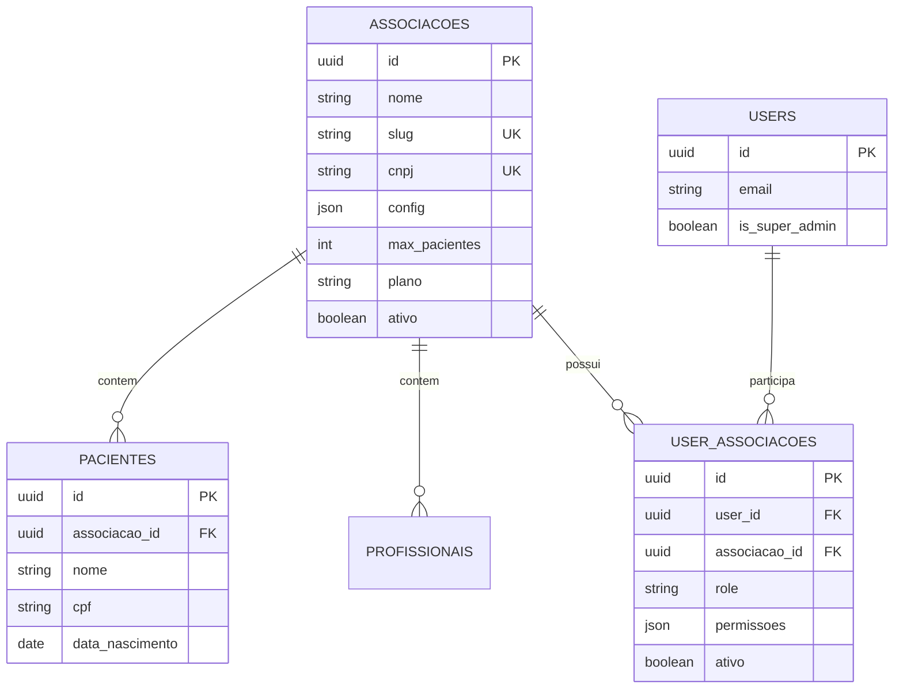

# Arquitetura SaaS Multi-Tenant - Aracannabis
**Versão:** 1.0  
**Data:** 2026-01-29  
**Status:** Design Aprovado (Não Implementado)

---

## 1. Visão Geral

Transformar o sistema atual (single-tenant) em uma plataforma SaaS que suporta múltiplas associações de pacientes (ABRACE, Santa Cannabis, Agrobuds, etc.) de forma isolada e segura.

### Princípios Fundamentais

1. **Isolamento de Dados:** Dados de uma associação NUNCA são visíveis para outra
2. **Shared Database, Shared Schema:** Todas as associações no mesmo banco, isoladas por `associacao_id`
3. **Filtro Obrigatório no Backend:** Middleware garante que toda query inclui filtro de tenant
4. **Auditoria Total:** Toda ação registra qual associação/usuário executou

---

## 2. Schema do Banco de Dados

### 2.1 Nova Tabela: `associacoes`

```sql
CREATE TABLE associacoes (
    id UUID PRIMARY KEY DEFAULT gen_random_uuid(),
    nome VARCHAR(255) NOT NULL,
    slug VARCHAR(100) NOT NULL UNIQUE, -- ex: 'abrace', 'santa-cannabis'
    cnpj VARCHAR(18) UNIQUE,
    razao_social VARCHAR(255),
    
    -- Configurações específicas (JSON)
    config JSON DEFAULT '{}', -- {logo_url, cores, smtp_config, etc}
    
    -- Limites do plano
    max_pacientes INTEGER DEFAULT 100,
    max_profissionais INTEGER DEFAULT 5,
    plano VARCHAR(50) DEFAULT 'basico', -- basico, profissional, enterprise
    
    -- Status
    ativo BOOLEAN DEFAULT true,
    data_expiracao DATE,
    
    -- Auditoria
    created_at TIMESTAMP DEFAULT CURRENT_TIMESTAMP,
    updated_at TIMESTAMP DEFAULT CURRENT_TIMESTAMP,
    
    -- Índices
    INDEX idx_slug (slug),
    INDEX idx_ativo (ativo)
);
```

**Exemplo de Registro:**
```json
{
  "id": "a1b2c3d4-...",
  "nome": "ABRACE - Associação Brasileira de Cannabis",
  "slug": "abrace",
  "cnpj": "12.345.678/0001-90",
  "config": {
    "logo_url": "https://...",
    "cores": {"primary": "#2E7D32", "secondary": "#66BB6A"},
    "smtp": {"host": "smtp.abrace.org.br", "port": 587}
  },
  "max_pacientes": 500,
  "plano": "profissional"
}
```

---

### 2.2 Alterações em Tabelas Existentes

**Regra:** Adicionar `associacao_id UUID NOT NULL` + Foreign Key em TODAS as entidades de negócio.

#### Tabelas Afetadas (Lista Completa)

```sql
-- CORE
ALTER TABLE pacientes ADD COLUMN associacao_id UUID NOT NULL REFERENCES associacoes(id);
ALTER TABLE profissionais ADD COLUMN associacao_id UUID NOT NULL REFERENCES associacoes(id);

-- CLÍNICO
ALTER TABLE prontuarios ADD COLUMN associacao_id UUID NOT NULL REFERENCES associacoes(id);
ALTER TABLE agendamentos ADD COLUMN associacao_id UUID NOT NULL REFERENCES associacoes(id);
ALTER TABLE evolucoes ADD COLUMN associacao_id UUID NOT NULL REFERENCES associacoes(id);
ALTER TABLE dosagens ADD COLUMN associacao_id UUID NOT NULL REFERENCES associacoes(id);
ALTER TABLE sintomas ADD COLUMN associacao_id UUID NOT NULL REFERENCES associacoes(id);
ALTER TABLE exames ADD COLUMN associacao_id UUID NOT NULL REFERENCES associacoes(id);
ALTER TABLE exame_imagens ADD COLUMN associacao_id UUID NOT NULL REFERENCES associacoes(id);

-- PRODUTOS E ESTOQUE
ALTER TABLE produtos ADD COLUMN associacao_id UUID NOT NULL REFERENCES associacoes(id);
ALTER TABLE estoque ADD COLUMN associacao_id UUID NOT NULL REFERENCES associacoes(id);

-- FINANCEIRO
ALTER TABLE planos ADD COLUMN associacao_id UUID REFERENCES associacoes(id); -- Pode ser NULL (planos globais)
ALTER TABLE pagamentos ADD COLUMN associacao_id UUID NOT NULL REFERENCES associacoes(id);

-- LGPD
ALTER TABLE consentimentos_lgpd ADD COLUMN associacao_id UUID NOT NULL REFERENCES associacoes(id);

-- COMPARTILHAMENTO
ALTER TABLE compartilhamentos_paciente ADD COLUMN associacao_id UUID NOT NULL REFERENCES associacoes(id);

-- Criar índices compostos para performance
CREATE INDEX idx_pacientes_associacao ON pacientes(associacao_id, id);
CREATE INDEX idx_profissionais_associacao ON profissionais(associacao_id, id);
CREATE INDEX idx_prontuarios_associacao ON prontuarios(associacao_id, paciente_id);
-- ... (repetir para todas as tabelas críticas)
```

---

### 2.3 Tabela de Relacionamento: `user_associacoes`

Permite que um usuário (profissional) tenha acesso a múltiplas associações com roles diferentes.

```sql
CREATE TABLE user_associacoes (
    id UUID PRIMARY KEY DEFAULT gen_random_uuid(),
    user_id UUID NOT NULL REFERENCES users(id) ON DELETE CASCADE,
    associacao_id UUID NOT NULL REFERENCES associacoes(id) ON DELETE CASCADE,
    
    -- Papel do usuário NESTA associação
    role VARCHAR(50) NOT NULL, -- 'admin', 'medico', 'enfermeiro', 'visualizador'
    
    -- Permissões específicas (opcional, se role não for suficiente)
    permissoes JSON DEFAULT '[]', -- ['criar_paciente', 'editar_prontuario', ...]
    
    -- Status
    ativo BOOLEAN DEFAULT true,
    data_inicio DATE DEFAULT CURRENT_DATE,
    data_fim DATE,
    
    -- Auditoria
    created_at TIMESTAMP DEFAULT CURRENT_TIMESTAMP,
    created_by UUID REFERENCES users(id),
    
    -- Constraints
    UNIQUE(user_id, associacao_id),
    INDEX idx_user_associacoes (user_id, associacao_id),
    INDEX idx_associacao_users (associacao_id, user_id)
);
```

**Exemplo:**
```
Dr. João (user_id=123) pode ser:
- Admin na ABRACE (associacao_id=aaa)
- Médico na Santa Cannabis (associacao_id=bbb)
```

---

### 2.4 Super Admin (Gestão do SaaS)

```sql
ALTER TABLE users ADD COLUMN is_super_admin BOOLEAN DEFAULT false;
```

**Super Admin:**
- Pode criar/editar/desativar associações
- Acessa dashboard global (todas as associações)
- Não precisa estar em `user_associacoes` para ver dados (bypass do filtro)

---

## 3. Estratégia de Isolamento

### ✅ Escolha: Filtro Obrigatório no Backend (Middleware)

**Implementação (Conceitual):**

```python
# middleware/tenant_context.py
from flask import g, request, abort
from functools import wraps

class TenantContextError(Exception):
    """Erro crítico: Request sem contexto de tenant"""
    pass

def set_tenant_context():
    """
    Middleware que define o tenant atual baseado no JWT ou header.
    
    ⚠️ REGRA CRÍTICA: NUNCA permite request sem associacao_id definida.
    ⚠️ NÃO HÁ FALLBACK SILENCIOSO.
    """
    
    # 1. Extrair associacao_id do token JWT ou header
    current_user = get_jwt_identity()
    associacao_id = request.headers.get('X-Associacao-ID')
    
    # 2. Se não veio no header, pegar do perfil do usuário (associação ativa)
    if not associacao_id:
        associacao_id = current_user.get('associacao_ativa')
    
    # 3. VALIDAÇÃO OBRIGATÓRIA (Fail-Fast)
    if not associacao_id and not is_super_admin(current_user):
        # ❌ NUNCA permitir request sem tenant
        logger.critical(f"Request sem associacao_id: user={current_user['id']}, endpoint={request.endpoint}")
        abort(400, "X-Associacao-ID obrigatório. Configure a associação ativa.")
    
    # 4. Validar se o usuário tem acesso a essa associação (exceto Super Admin)
    if not is_super_admin(current_user):
        acesso = UserAssociacao.query.filter_by(
            user_id=current_user['id'],
            associacao_id=associacao_id,
            ativo=True
        ).first()
        
        if not acesso:
            logger.warning(f"Tentativa de acesso negado: user={current_user['id']}, associacao={associacao_id}")
            abort(403, "Você não tem acesso a esta associação")
    
    # 5. Armazenar no contexto da request (IMUTÁVEL durante a request)
    g.associacao_id = associacao_id
    g.is_super_admin = is_super_admin(current_user)
    
    # 6. Log de auditoria (toda request registra qual associação acessou)
    logger.info(f"Tenant context set: associacao={associacao_id}, user={current_user['id']}, endpoint={request.endpoint}")

# Aplicar em TODAS as rotas protegidas (exceto /auth/login, /health)
BYPASS_ROUTES = ['/api/auth/login', '/api/auth/register', '/api/health', '/api/status']

@app.before_request
def apply_tenant_filter():
    if request.endpoint and request.endpoint not in BYPASS_ROUTES:
        set_tenant_context()

def require_tenant(f):
    """
    Decorator adicional para rotas críticas.
    Garante que associacao_id está no contexto MESMO se middleware falhar.
    """
    @wraps(f)
    def decorated_function(*args, **kwargs):
        if not hasattr(g, 'associacao_id'):
            raise TenantContextError("Contexto de tenant não definido. Middleware falhou?")
        return f(*args, **kwargs)
    return decorated_function

# Uso em rotas críticas:
# @app.route('/api/pacientes')
# @jwt_required()
# @require_tenant  # ← Dupla validação
# def listar_pacientes():
#     ...
```

**Modificação nas Queries:**

```python
# ANTES (Single-Tenant) ❌
pacientes = Paciente.query.all()

# DEPOIS (Multi-Tenant) ✅
from flask import g

def get_current_tenant():
    """
    Retorna associacao_id do contexto.
    Se não existir, FALHA (nunca retorna None silenciosamente).
    """
    if not hasattr(g, 'associacao_id'):
        raise TenantContextError("Tentativa de query sem tenant context")
    return g.associacao_id

# Opção 1: Manual (verboso, mas explícito)
pacientes = Paciente.query.filter_by(associacao_id=get_current_tenant()).all()

# Opção 2: Scoped Session (RECOMENDADO - filtro automático)
# Configurar SQLAlchemy para SEMPRE adicionar o filtro
```

**Implementação com Scoped Session (Avançado):**

```python
# models/__init__.py
from sqlalchemy import event
from sqlalchemy.orm import Session
from flask import g

@event.listens_for(Session, "do_orm_execute")
def receive_do_orm_execute(orm_execute_state):
    """
    Adiciona filtro de tenant automaticamente em TODAS as queries.
    
    ⚠️ CRÍTICO: Se associacao_id não estiver no contexto, a query FALHA.
    """
    
    # Super admin bypassa (único caso permitido)
    if g.get('is_super_admin', False):
        return
    
    # Pegar associacao_id do contexto (OBRIGATÓRIO)
    associacao_id = g.get('associacao_id')
    
    if not associacao_id:
        # ❌ NUNCA permitir query sem tenant
        raise TenantContextError(
            f"Query executada sem tenant context: {orm_execute_state.statement}"
        )
    
    # Adicionar filtro automaticamente
    if orm_execute_state.is_select:
        for entity in orm_execute_state.bind_arguments.get('mapper', []):
            if hasattr(entity, 'associacao_id'):
                orm_execute_state.statement = orm_execute_state.statement.filter(
                    entity.associacao_id == associacao_id
                )
```

**Regras de Ouro (Memorizar):**

1. ✅ **Nenhuma query roda sem saber "para qual associação"**
2. ✅ **Super Admin é o ÚNICO bypass explícito** (com log de auditoria)
3. ✅ **Fail-Fast:** Se `associacao_id` não existe → Request falha (HTTP 400/500)
4. ✅ **Sem fallbacks silenciosos:** Nunca assumir associação "default"
5. ✅ **Auditoria total:** Toda request loga qual associação acessou qual recurso

---

---

## 4.5 Regras Críticas de Segurança (OBRIGATÓRIAS)

### 🔒 Regra 1: Migração de Dados Existentes (Zero Tolerância a NULL)

**Problema:** Dados antigos sem `associacao_id` podem vazar entre tenants.

**Solução Obrigatória:**

```sql
-- FASE 1.1: Criar associação "legacy" (ANTES de adicionar colunas)
INSERT INTO associacoes (id, nome, slug, cnpj, plano, ativo) 
VALUES (
    'REDACTED', -- UUID fixo para referência
    'Aracannabis Legacy (Migração)',
    'aracannabis-legacy',
    NULL,
    'enterprise',
    true
);

-- FASE 1.2: Adicionar colunas NULLABLE (temporariamente)
ALTER TABLE pacientes ADD COLUMN associacao_id UUID REFERENCES associacoes(id);
ALTER TABLE profissionais ADD COLUMN associacao_id UUID REFERENCES associacoes(id);
-- ... (todas as tabelas)

-- FASE 1.3: Popular TODOS os registros (OBRIGATÓRIO)
UPDATE pacientes 
SET associacao_id = 'REDACTED' 
WHERE associacao_id IS NULL;

UPDATE profissionais 
SET associacao_id = 'REDACTED' 
WHERE associacao_id IS NULL;

-- ... (repetir para TODAS as tabelas)

-- FASE 1.4: Validar (ZERO registros NULL)
SELECT 'pacientes' AS tabela, COUNT(*) AS nulls FROM pacientes WHERE associacao_id IS NULL
UNION ALL
SELECT 'profissionais', COUNT(*) FROM profissionais WHERE associacao_id IS NULL;
-- Resultado esperado: 0 em todas as linhas

-- FASE 1.5: Tornar NOT NULL (só após validar)
ALTER TABLE pacientes ALTER COLUMN associacao_id SET NOT NULL;
ALTER TABLE profissionais ALTER COLUMN associacao_id SET NOT NULL;
-- ... (todas as tabelas)
```

**Checklist de Migração (Obrigatório):**

- [ ] Criar associação "legacy" ANTES de qualquer ALTER TABLE
- [ ] Adicionar colunas como NULLABLE primeiro
- [ ] Popular 100% dos registros (nenhum NULL)
- [ ] Validar com queries de contagem
- [ ] Só então tornar NOT NULL
- [ ] Criar índices compostos
- [ ] Testar query de um paciente (deve retornar associacao_id)

**❌ NUNCA fazer:**
```sql
-- ERRADO: Adicionar NOT NULL direto (vai falhar)
ALTER TABLE pacientes ADD COLUMN associacao_id UUID NOT NULL;
```

---

### 🔒 Regra 2: Autenticação ≠ Autorização (Separação Conceitual)

**Problema:** Confundir "quem você é" com "o que você pode fazer".

**Solução Obrigatória:**

```python
# ✅ CORRETO: Separação clara

# 1. AUTENTICAÇÃO (Quem você é)
@app.route('/api/auth/login')
def login():
    user = authenticate(email, password)  # Valida credenciais
    token = create_jwt(user)  # Gera token
    return {'token': token}

# 2. AUTORIZAÇÃO (O que você pode fazer)
@app.route('/api/pacientes')
@jwt_required()  # ← Autenticação
@require_tenant  # ← Autorização (Parte 1: Qual associação?)
@require_role('medico')  # ← Autorização (Parte 2: Qual papel?)
def listar_pacientes():
    # Aqui sabemos:
    # - Quem é o usuário (JWT)
    # - Em qual associação ele está atuando (g.associacao_id)
    # - Qual papel ele tem nessa associação (role)
    pass
```

**Modelo Mental Correto:**

```
Login bem-sucedido
    ↓
Token JWT gerado (contém user_id)
    ↓
Request com token + X-Associacao-ID
    ↓
Middleware valida:
    1. Token válido? (Autenticação)
    2. Usuário tem acesso a essa associação? (Autorização - Parte 1)
    3. Usuário tem role adequado? (Autorização - Parte 2)
    ↓
Request processada com contexto completo:
    - user_id
    - associacao_id
    - role
```

**❌ NUNCA fazer:**
```python
# ERRADO: Assumir que "estar logado" = "pode acessar tudo"
@app.route('/api/pacientes')
@jwt_required()
def listar_pacientes():
    # ❌ Sem validar associacao_id
    # ❌ Sem validar role
    return Paciente.query.all()  # VAZAMENTO DE DADOS
```

**Regras de Ouro:**

1. ✅ **Login não dá permissão** → Apenas identifica
2. ✅ **Permissão sempre é tripla:** `user + associacao + role`
3. ✅ **Sem role "global"** fora do Super Admin
4. ✅ **Cada request valida os 3 componentes**

---

### 🔒 Regra 3: Separação de Responsabilidades (Fronteiras Jurídicas)

**Problema:** Misturar camadas cria responsabilidade legal confusa.

**Solução Obrigatória:**

```
┌─────────────────────────────────────────────────┐
│  CAMADA SAAS (Multi-Tenant)                     │
│  Responsabilidade: Isolamento de dados          │
│  Controlador LGPD: Aracannabis (plataforma)     │
│                                                  │
│  ┌───────────────────────────────────────────┐  │
│  │  CAMADA SGAC (Orquestrador)               │  │
│  │  Responsabilidade: Regras de negócio      │  │
│  │  Controlador LGPD: Associação específica  │  │
│  │                                            │  │
│  │  ┌─────────────────────────────────────┐  │  │
│  │  │  CAMADA PRONTUÁRIO (Clínico)        │  │  │
│  │  │  Responsabilidade: Dados médicos    │  │  │
│  │  │  Controlador LGPD: Médico/Paciente  │  │  │
│  │  └─────────────────────────────────────┘  │  │
│  └───────────────────────────────────────────┘  │
└─────────────────────────────────────────────────┘
```

**Tradução Prática:**

| Camada | O que FAZ | O que NÃO FAZ |
|--------|-----------|---------------|
| **SaaS Multi-Tenant** | Garante que Associação A não vê dados de B | ❌ Não decide regras clínicas |
| **SGAC** | Orquestra fluxos (agendamento, prescrição) | ❌ Não armazena dados médicos direto |
| **Prontuário** | Armazena dados clínicos (sintomas, dosagens) | ❌ Não gerencia multi-tenancy |

**Exemplo de Implementação Correta:**

```python
# routes/pacientes.py (SGAC - Orquestrador)
@app.route('/api/pacientes', methods=['POST'])
@jwt_required()
@require_tenant
@require_role('medico')
def criar_paciente():
    # 1. SGAC valida regras de negócio
    if not validar_cpf(request.json['cpf']):
        return {'error': 'CPF inválido'}, 400
    
    # 2. SaaS garante isolamento
    novo_paciente = Paciente(
        associacao_id=g.associacao_id,  # ← SaaS
        nome=request.json['nome'],
        cpf=request.json['cpf']
    )
    
    # 3. Prontuário armazena dados clínicos (se houver)
    if request.json.get('diagnostico'):
        prontuario = Prontuario(
            paciente_id=novo_paciente.id,
            associacao_id=g.associacao_id,  # ← SaaS (mesmo no prontuário)
            diagnostico=request.json['diagnostico']
        )
    
    db.session.commit()
    return {'id': novo_paciente.id}, 201
```

**Regras de Ouro:**

1. ✅ **SaaS é transversal** → Toda tabela tem `associacao_id`
2. ✅ **SGAC não bypassa SaaS** → Sempre respeita `g.associacao_id`
3. ✅ **Prontuário não gerencia tenants** → Recebe `associacao_id` pronto
4. ✅ **Cada camada tem um "controlador LGPD" claro**

---

### 🔒 Regra 4: Auditoria Obrigatória (Rastreabilidade Total)

**Problema:** Sem logs, impossível provar conformidade LGPD.

**Solução Obrigatória:**

```python
# Toda ação sensível DEVE logar:
# - Quem (user_id)
# - Onde (associacao_id)
# - O quê (ação)
# - Quando (timestamp)
# - Dados (antes/depois)

def log_acao(acao, entidade, entidade_id, dados_anteriores=None, dados_novos=None):
    AuditLog.create(
        associacao_id=g.associacao_id,
        user_id=get_jwt_identity()['id'],
        acao=acao,
        entidade=entidade,
        entidade_id=entidade_id,
        dados_anteriores=dados_anteriores,
        dados_novos=dados_novos,
        ip_address=request.remote_addr,
        user_agent=request.headers.get('User-Agent')
    )

# Uso:
@app.route('/api/pacientes/<id>', methods=['PUT'])
@jwt_required()
@require_tenant
def atualizar_paciente(id):
    paciente = Paciente.query.get(id)
    dados_antigos = paciente.to_dict()
    
    paciente.nome = request.json['nome']
    db.session.commit()
    
    log_acao('UPDATE_PACIENTE', 'pacientes', id, dados_antigos, paciente.to_dict())
    return {'success': True}
```

---

## 4. Plano de Migração (Passo a Passo)

### Fase 1: Preparação (Sem Downtime)
1. ✅ Criar tabela `associacoes`
2. ✅ Inserir associação "padrão" (migrar dados existentes para ela)
   ```sql
   INSERT INTO associacoes (nome, slug, cnpj) 
   VALUES ('Aracannabis Principal', 'aracannabis-principal', NULL);
   ```
3. ✅ Adicionar colunas `associacao_id` em TODAS as tabelas (NULLABLE inicialmente)
4. ✅ Popular `associacao_id` com o ID da associação padrão
   ```sql
   UPDATE pacientes SET associacao_id = (SELECT id FROM associacoes WHERE slug='aracannabis-principal');
   -- Repetir para todas as tabelas
   ```
5. ✅ Tornar `associacao_id` NOT NULL após popular
   ```sql
   ALTER TABLE pacientes ALTER COLUMN associacao_id SET NOT NULL;
   ```

### Fase 2: Backend (Com Testes)
1. ✅ Implementar middleware de tenant context
2. ✅ Atualizar TODAS as queries para usar filtro
3. ✅ Criar endpoints de gestão de associações (CRUD)
4. ✅ Implementar `user_associacoes` (relacionamento N:N)
5. ✅ Testes de isolamento (garantir que Associação A não vê dados de B)

### Fase 3: Frontend
1. ✅ Adicionar seletor de associação no header (dropdown)
2. ✅ Armazenar associação ativa no localStorage
3. ✅ Enviar `X-Associacao-ID` em TODAS as requisições
4. ✅ Tela de gestão de associações (admin)

### Fase 4: Importação de Dados Novos
1. ✅ Atualizar script de importação (Etapa 1.5) para incluir `associacao_id`
2. ✅ Detectar associação automaticamente (campo "associacao_detectada" do Excel)
3. ✅ Permitir override manual

---

## 5. Casos de Uso

### 5.1 Cadastro de Nova Associação

```python
# POST /api/admin/associacoes
{
  "nome": "ABRACE - Associação Brasileira de Cannabis",
  "slug": "abrace",
  "cnpj": "12.345.678/0001-90",
  "config": {
    "logo_url": "https://abrace.org.br/logo.png",
    "cores": {"primary": "#2E7D32"}
  },
  "plano": "profissional",
  "max_pacientes": 500
}
```

### 5.2 Adicionar Usuário a uma Associação

```python
# POST /api/admin/associacoes/{associacao_id}/usuarios
{
  "user_id": "uuid-do-medico",
  "role": "medico",
  "permissoes": ["criar_paciente", "editar_prontuario"]
}
```

### 5.3 Usuário Trocando de Associação (Frontend)

```javascript
// Header do app
<Select value={associacaoAtiva} onChange={trocarAssociacao}>
  <MenuItem value="aaa">ABRACE</MenuItem>
  <MenuItem value="bbb">Santa Cannabis</MenuItem>
</Select>

function trocarAssociacao(novaAssociacao) {
  localStorage.setItem('associacao_ativa', novaAssociacao);
  // Todas as próximas requests vão incluir X-Associacao-ID: novaAssociacao
  window.location.reload(); // Recarregar dados
}
```

---

## 6. Segurança e Compliance

### 6.1 LGPD
- Cada associação é um "controlador" independente
- Consentimentos são por associação
- Exportação de dados filtra por `associacao_id`

### 6.2 Auditoria
```sql
CREATE TABLE audit_log (
    id UUID PRIMARY KEY,
    associacao_id UUID NOT NULL,
    user_id UUID NOT NULL,
    acao VARCHAR(100), -- 'CREATE_PACIENTE', 'UPDATE_PRONTUARIO'
    entidade VARCHAR(50), -- 'pacientes', 'prontuarios'
    entidade_id UUID,
    dados_anteriores JSON,
    dados_novos JSON,
    ip_address VARCHAR(45),
    created_at TIMESTAMP DEFAULT CURRENT_TIMESTAMP
);
```

---

## 7. Performance

### 7.1 Índices Críticos
Todos os índices compostos devem começar com `associacao_id`:

```sql
CREATE INDEX idx_pacientes_associacao_nome ON pacientes(associacao_id, nome);
CREATE INDEX REDACTED ON prontuarios(associacao_id, paciente_id);
```

### 7.2 Particionamento (Futuro)
Se uma associação crescer muito (>100k pacientes), considerar particionamento por `associacao_id`.

---

## 8. Diagrama ER (Mermaid)



---

## 9. Checklist de Implementação

### Banco de Dados
- [ ] Criar tabela `associacoes`
- [ ] Criar tabela `user_associacoes`
- [ ] Adicionar `associacao_id` em todas as tabelas de negócio
- [ ] Criar índices compostos
- [ ] Popular dados existentes com associação padrão
- [ ] Criar constraints e foreign keys

### Backend
- [ ] Middleware de tenant context
- [ ] Scoped session com filtro automático
- [ ] Endpoints CRUD de associações
- [ ] Endpoints de gestão de usuários por associação
- [ ] Atualizar TODAS as queries existentes
- [ ] Testes de isolamento
- [ ] Auditoria de ações

### Frontend
- [ ] Seletor de associação (header)
- [ ] Armazenamento de associação ativa
- [ ] Envio de header `X-Associacao-ID`
- [ ] Tela de gestão de associações
- [ ] Tela de gestão de usuários por associação
- [ ] Filtros por associação em listagens

### Importação
- [ ] Atualizar script de importação (Etapa 1.5)
- [ ] Detectar associação do Excel
- [ ] Validar associação antes de inserir

---

## 10. Riscos e Mitigações

| Risco | Probabilidade | Impacto | Mitigação |
|-------|---------------|---------|-----------|
| Vazamento de dados entre tenants | Baixa | CRÍTICO | Testes automatizados de isolamento + Code review obrigatório |
| Performance degradada | Média | Alto | Índices compostos + Monitoramento |
| Migração de dados falhar | Baixa | Alto | Dry-run + Backup completo antes |
| Usuário perder acesso após migração | Média | Médio | Criar `user_associacoes` ANTES de ativar filtro |

---

## 11. Cronograma Estimado

| Fase | Duração | Dependências |
|------|---------|--------------|
| Design (este doc) | ✅ Completo | - |
| Etapa 1.5 (Importador) | 2-3 dias | Excel validado |
| Migração de Banco | 1 dia | Etapa 1.5 completa |
| Backend Multi-Tenant | 3-5 dias | Migração de banco |
| Frontend Multi-Tenant | 2-3 dias | Backend pronto |
| Testes e Ajustes | 2 dias | Tudo implementado |
| **TOTAL** | **10-14 dias** | - |

---

**Documento aprovado para implementação.**  
**Próximo passo:** Aguardar validação do Excel → Iniciar Etapa 1.5.
