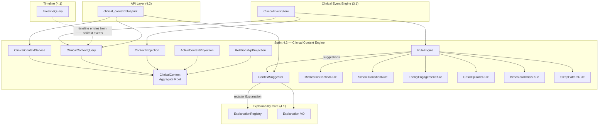
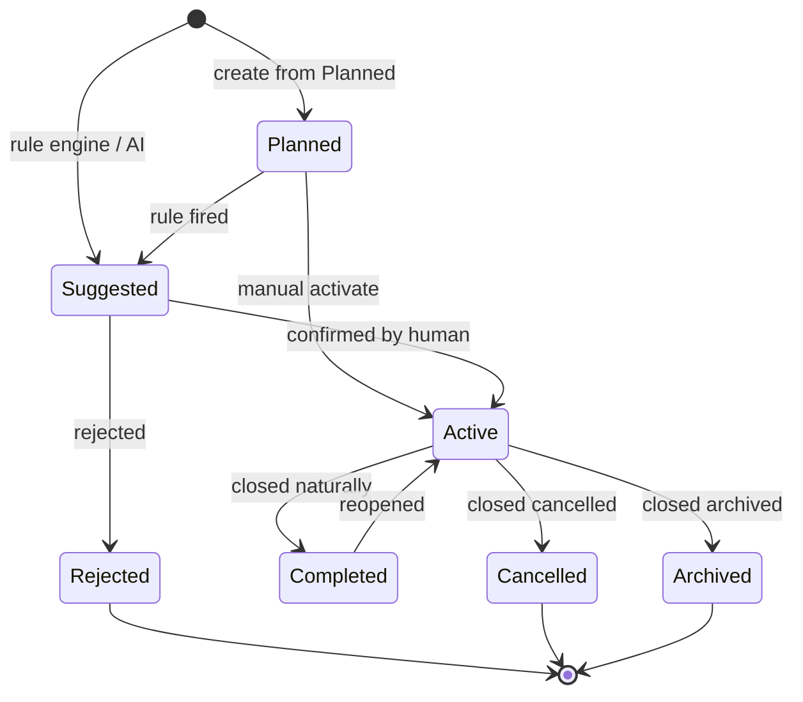

# ADR-0003 — Sprint 4.2 — Clinical Context Engine

> **Status:** Em progresso
> **Data:** 2026-07-17
> **Sub-sprint de:** [Sprint 4 — Clinical Intelligence Platform](./vivid-snuggling-moth.md)
> **Anterior:** [Sprint 4.1 — Foundations](./SPRINT_4_1_REPORT.md)

---

## Contexto

Após Sprint 4.1 (Foundations: Timeline + Explainability), o AraOS agora
consegue ler e explicar eventos clínicos. Mas a realidade clínica é
**contextual**: uma crise não acontece no vácuo — ela depende de fatores
familiares, escolares, ambientais, comportamentais e de desenvolvimento.

A visão inicial de "Clinical Episode Engine" foi ampliada para **Clinical
Context Engine**: uma camada capaz de representar **qualquer contexto
relevante** para a evolução longitudinal do paciente, não apenas episódios.

### Princípios mantidos (Sprint 4)

- DDD rigoroso (aggregate root + domain events + application services)
- Event Sourcing + replay determinístico
- Multi-tenancy + audit chain
- Explainability obrigatória (toda análise emite Explanation)
- Sem ML, sem mutação automática — tudo via sugestão + confirmação humana

---

## Decisão

Construir `ClinicalContext` como Aggregate Root unificado, com
**10 subtipos especializados**, state machine de **7 estados**,
**rule engine** com 6 regras built-in, e **grafo de relacionamentos**.

### Bounded Context Map



---

## Aggregate Root: ClinicalContext

### Estrutura

```python
@dataclass(frozen=True)
class ClinicalContext:
    context_id: str                        # ctx_<uuid16>
    tenant_id: str
    patient_id: str
    context_type: ContextType              # enum 10 valores
    status: ContextStatus                  # enum 7 valores
    origin: ContextOrigin                  # enum 5 valores
    title: str
    description: str
    reason: str                            # por que foi criado
    observations: List[str]                # notas livres
    start_date: datetime
    end_date: Optional[datetime]
    confidence_score: float                # 1.0 manual; <1.0 suggested
    source_event_ids: List[str]            # eventos que originaram
    linked_event_ids: List[str]
    linked_diagnosis_ids: List[str]
    linked_phenotype_ids: List[str]
    linked_intervention_ids: List[str]
    linked_outcome_ids: List[str]
    linked_assessment_ids: List[str]
    professionals: List[str]               # user_ids envolvidos
    confirmed_by: Optional[str]
    confirmed_at: Optional[datetime]
    rejected_by: Optional[str]
    rejected_at: Optional[datetime]
    suggestion_id: Optional[str]           # se originou de Rule Engine
    explanation_id: Optional[str]          # link para Explanation
    created_at: datetime
    created_by: str
    updated_at: datetime
    aggregate_version: int
```

### Tipos (ContextType)

| Tipo | Descrição |
|---|---|
| `clinical_episode` | Crise, hospitalização, surto, etc. |
| `medication_context` | Período de uso de medicação |
| `school_context` | Mudança escolar, adaptação |
| `family_context` | Eventos familiares relevantes |
| `environmental_context` | Mudança de ambiente, clima |
| `developmental_milestone` | Marco de desenvolvimento |
| `behavioral_phase` | Padrão comportamental persistente |
| `sleep_pattern` | Padrão de sono observado |
| `educational_transition` | Transição educacional |
| `social_context` | Contexto social (isolamento, inclusão, etc.) |

### State Machine (ContextStatus)



**Invariantes:**
- `confidence_score` < 1.0 apenas se `origin` ∈ {RULE_ENGINE, ARTIFICIAL_INTELLIGENCE}
- `confirmed_by`/`confirmed_at` obrigatórios quando `status == Active` (a partir de Suggested)
- `end_date` obrigatório quando `status ∈ {Completed, Cancelled, Archived}`

### Origem (ContextOrigin)

| Valor | Descrição |
|---|---|
| `manual` | Criado por profissional de saúde |
| `rule_engine` | Sugerido por regra automática |
| `artificial_intelligence` | Sugerido por modelo (futuro) |
| `import` | Importado de sistema externo |
| `research` | Definido por estudo clínico |

---

## Rule Engine

### Rule ABC

```python
class Rule(ABC):
    rule_id: str
    description: str
    min_confidence: float

    @abstractmethod
    def evaluate(
        self,
        events: List[Dict[str, Any]],       # eventos do paciente (ordenados)
        existing_contexts: List[ClinicalContext],
    ) -> List[ContextSuggestion]:
        """Pure function: 0+ suggestions."""
```

### 6 Regras Built-in

| # | Rule ID | Trigger | Sugere | Confiança |
|---|---|---|---|---|
| 1 | `medication_start` | `MEDICATION_STARTED` | MedicationContext | 0.95 |
| 2 | `school_change` | `SCHOOL_CHANGED` | SchoolContext | 0.90 |
| 3 | `family_meeting` | `FAMILY_MEETING` | FamilyContext | 0.85 |
| 4 | `crisis_event` | `CRISIS_RECORDED` ou `HOSPITALIZATION` ou `SURGERY` | ClinicalEpisode | 0.95 |
| 5 | `behavioral_crisis` | 2+ `OUTCOME_WORSENING` em 14d | ClinicalEpisode (subtipo=behavioral) | 0.80 |
| 6 | `sleep_pattern` | 3+ `SLEEP_CHANGED` em 30d | SleepPattern | 0.75 |

**Cada sugestão gera uma Explanation** com:
- `analysis_type = CONTEXT_SUGGESTION`
- `question = "Por que este contexto foi sugerido?"`
- `method = "rule_engine:<rule_id>"`
- `contributing_event_ids = [...]`
- `limitations` explicando a confiança e suposições

---

## ContextRelationship (Grafo)

### Tipos de Relacionamento

```python
class RelationshipType(str, Enum):
    INFLUENCED = "influenced"          # School → Behavioral
    RELATED_TO = "related_to"          # qualquer associação
    IMPACTED = "impacted"              # Medication → Outcome
    PRECEDED = "preceded"              # temporal: A antes de B
    CAUSED = "caused"                  # raro e explícito
    CO_OCCURRED_WITH = "co_occurred"   # sobreposição temporal
```

### Grafo

```python
@dataclass(frozen=True)
class ContextRelationship:
    relationship_id: str
    source_context_id: str
    target_context_id: str
    relationship_type: RelationshipType
    evidence_event_ids: List[str]      # eventos que sustentam
    confidence: float
    created_at: datetime
    created_by: str
```

**Invariante:** `source_context_id != target_context_id` (sem self-loop).

---

## Query Engine

5 tipos de consulta:

```python
class ClinicalContextQuery(ABC):
    def for_patient(tenant_id, patient_id) -> List[ClinicalContext]: ...
    def active_at(tenant_id, patient_id, at_date: datetime) -> List[ClinicalContext]: ...
    def co_occurred(tenant_id, patient_id, date_a, date_b) -> List[Tuple[ClinicalContext, ClinicalContext]]: ...
    def influenced_outcome(tenant_id, outcome_id) -> List[ClinicalContext]: ...
    def preceded_improvement(tenant_id, patient_id, window_days=30) -> List[ClinicalContext]: ...
    def active_during(tenant_id, intervention_id) -> List[ClinicalContext]: ...
```

---

## Database Schema

### `clinical_contexts`

```sql
CREATE TABLE clinical_contexts (
  id VARCHAR(64) PRIMARY KEY,
  tenant_id VARCHAR(64) NOT NULL,
  patient_id VARCHAR(64) NOT NULL,
  context_type VARCHAR(64) NOT NULL,
  status VARCHAR(32) NOT NULL,
  origin VARCHAR(32) NOT NULL,
  title VARCHAR(255) NOT NULL,
  description TEXT,
  reason TEXT,
  observations_json TEXT,            -- JSON array
  start_date TIMESTAMP WITH TIMEZONE NOT NULL,
  end_date TIMESTAMP WITH TIMEZONE,
  confidence_score FLOAT NOT NULL,
  source_event_ids_json TEXT,        -- JSON array
  linked_event_ids_json TEXT,
  linked_diagnosis_ids_json TEXT,
  linked_phenotype_ids_json TEXT,
  linked_intervention_ids_json TEXT,
  linked_outcome_ids_json TEXT,
  linked_assessment_ids_json TEXT,
  professionals_json TEXT,
  confirmed_by VARCHAR(64),
  confirmed_at TIMESTAMP WITH TIMEZONE,
  rejected_by VARCHAR(64),
  rejected_at TIMESTAMP WITH TIMEZONE,
  suggestion_id VARCHAR(64),
  explanation_id VARCHAR(64),
  created_at TIMESTAMP WITH TIMEZONE NOT NULL,
  created_by VARCHAR(64) NOT NULL,
  updated_at TIMESTAMP WITH TIMEZONE NOT NULL,
  aggregate_version INTEGER NOT NULL DEFAULT 1,
  deleted_at TIMESTAMP WITH TIMEZONE,
  -- Indexes
  INDEX ix_contexts_tenant_patient (tenant_id, patient_id),
  INDEX ix_contexts_tenant_status (tenant_id, status),
  INDEX ix_contexts_tenant_type (tenant_id, context_type),
  INDEX ix_contexts_tenant_dates (tenant_id, start_date, end_date),
  INDEX ix_contexts_explanation (explanation_id)
);
```

### `clinical_context_relationships`

```sql
CREATE TABLE clinical_context_relationships (
  id VARCHAR(64) PRIMARY KEY,
  tenant_id VARCHAR(64) NOT NULL,
  source_context_id VARCHAR(64) NOT NULL,
  target_context_id VARCHAR(64) NOT NULL,
  relationship_type VARCHAR(32) NOT NULL,
  evidence_event_ids_json TEXT,
  confidence FLOAT NOT NULL,
  created_at TIMESTAMP WITH TIMEZONE NOT NULL,
  created_by VARCHAR(64) NOT NULL,
  deleted_at TIMESTAMP WITH TIMEZONE,
  -- Constraint
  UNIQUE INDEX uq_rel_pair (source_context_id, target_context_id, relationship_type) WHERE deleted_at IS NULL
);
```

### `clinical_context_processed_events`

```sql
CREATE TABLE clinical_context_processed_events (
  event_id VARCHAR(64) PRIMARY KEY,
  processor VARCHAR(64) NOT NULL,
  processed_at TIMESTAMP WITH TIMEZONE NOT NULL
);
```

---

## Event Catalog (10 novos)

| Event Type | Producer | Description |
|---|---|---|
| `CLINICAL_CONTEXT_SUGGESTED` | `intelligence` | Rule engine gerou sugestão |
| `CLINICAL_CONTEXT_CREATED` | `intelligence` | Contexto criado manualmente |
| `CLINICAL_CONTEXT_ACTIVATED` | `intelligence` | Sugerido → Ativo |
| `CLINICAL_CONTEXT_UPDATED` | `intelligence` | Metadados alterados |
| `CLINICAL_CONTEXT_CLOSED` | `intelligence` | Completed/Cancelled/Archived |
| `CLINICAL_CONTEXT_REOPENED` | `intelligence` | Completed → Ativo |
| `CLINICAL_CONTEXT_LINKED` | `intelligence` | Relacionamento criado |
| `CLINICAL_CONTEXT_UNLINKED` | `intelligence` | Relacionamento removido |
| `CLINICAL_CONTEXT_REJECTED` | `intelligence` | Sugestão rejeitada |
| `CLINICAL_CONTEXT_TYPE_CONFIRMED` | `intelligence` | Tipo de contexto sugerido confirmado |

**AnalysisType adicional**: `CONTEXT_SUGGESTION = "context_suggestion"` no `Explanation`.

---

## Permissions (5 novas)

```python
INTELLIGENCE_CONTEXT_READ = "intelligence.context.read"
INTELLIGENCE_CONTEXT_WRITE = "intelligence.context.write"
INTELLIGENCE_CONTEXT_CONFIRM = "intelligence.context.confirm"
INTELLIGENCE_CONTEXT_RULE_RUN = "intelligence.context.rule.run"
INTELLIGENCE_CONTEXT_QUERY = "intelligence.context.query"
```

### Role nova

```python
ROLE_INTELLIGENCE_CURATOR = Role(
    name="intelligence_curator",
    permissions=frozenset({
        INTELLIGENCE_CONTEXT_READ,
        INTELLIGENCE_CONTEXT_WRITE,
        INTELLIGENCE_CONTEXT_CONFIRM,
        INTELLIGENCE_CONTEXT_RULE_RUN,
        INTELLIGENCE_CONTEXT_QUERY,
        EXPLAINABILITY_READ,
        EXPLAINABILITY_AUDIT,
        # read-only de outros intelligence
        INTELLIGENCE_TIMELINE_READ,
        INTELLIGENCE_ANALYTICS_READ,
        INTELLIGENCE_CORRELATION_READ,
    }),
    description="Curador de Inteligência Clínica — revisão de contextos e explicações",
)
```

### Extensão `ROLE_NEURODEVELOPMENTAL_PHYSICIAN`

Adicionar:
- `INTELLIGENCE_CONTEXT_READ`
- `INTELLIGENCE_CONTEXT_WRITE`
- `INTELLIGENCE_CONTEXT_CONFIRM`
- `INTELLIGENCE_CONTEXT_QUERY`

---

## API Endpoints (15+)

| Método | Path | Descrição |
|---|---|---|
| POST | `/api/intelligence/contexts` | Criar contexto manual |
| GET | `/api/intelligence/contexts/{id}` | Ler 1 contexto |
| PATCH | `/api/intelligence/contexts/{id}` | Atualizar metadados |
| POST | `/api/intelligence/contexts/{id}/activate` | Planned→Active |
| POST | `/api/intelligence/contexts/{id}/close` | Active→Completed/Cancelled/Archived |
| POST | `/api/intelligence/contexts/{id}/reopen` | Completed→Active |
| POST | `/api/intelligence/contexts/{id}/reject` | Sugerido→Rejected |
| POST | `/api/intelligence/contexts/{id}/confirm` | Sugerido→Active |
| POST | `/api/intelligence/contexts/{id}/link` | Criar relacionamento |
| DELETE | `/api/intelligence/contexts/{id}/link/{rel_id}` | Remover relacionamento |
| GET | `/api/intelligence/contexts` | Listar (filter: type, status, patient) |
| GET | `/api/intelligence/contexts/{id}/timeline` | Eventos do contexto |
| GET | `/api/intelligence/contexts/{id}/relationships` | Grafo do contexto |
| POST | `/api/intelligence/contexts/suggest` | Rodar rule engine |
| GET | `/api/intelligence/contexts/active-at` | Query: ativos em data |
| GET | `/api/intelligence/contexts/co-occurred` | Query: coexistiram |
| GET | `/api/intelligence/contexts/influenced-outcome` | Query: influenciaram outcome |
| GET | `/api/intelligence/contexts/preceded-improvement` | Query: precederam melhora |

---

## Projections

### ContextProjection

Materializa estado completo por `context_id`. **Idempotente** via
`clinical_context_processed_events`. Consome todos os 10 events de contexto.

### ActiveContextProjection

Denormalização: para cada `(tenant_id, patient_id)`, lista apenas contextos
com `status IN ('Active', 'Suggested')`. Usado pelo `/active-at` query.

### RelationshipProjection

Índice reverso por `target_context_id` para grafo. Permite listar
"quem aponta para este contexto" rapidamente.

---

## Definition of Done

- [ ] Domain layer com state machine completo (todas transições testadas)
- [ ] 6 regras built-in funcionando
- [ ] Rule Engine com `RuleEngine ABC` + impl + extensibilidade
- [ ] ContextSuggester integrado com ExplanationRegistry
- [ ] 5 query types implementados
- [ ] SQL persistence + migration
- [ ] 4 projections (3 novas + 1 contribuição para Timeline)
- [ ] 10 novos event types no catálogo
- [ ] 5 novas permissões + 1 nova role
- [ ] ≥95% cobertura em `araos/clinical/context/`
- [ ] Replay determinístico validado
- [ ] Idempotência (1x, 2x, 50x) validada
- [ ] Out-of-order events validado
- [ ] Tenant isolation validada
- [ ] API HTTP com auth JWT
- [ ] Documentação `docs/SPRINT_4_2_REPORT.md`
- [ ] Memory atualizado

---

## Compatibilidade

✅ Sem quebra de Sprints anteriores:
- **Sprint 3.1**: ClinicalEventStore consumido via `query()` — read-only
- **Sprint 3.2**: NeurodevelopmentalRegistry não modificado
- **Sprint 4.1**: TimelineQuery reusado; ExplanationRegistry consumido (write-side)
- **Sprint 4.5**: Dashboard Engine vai compor ContextProjection + ActiveContextProjection

---

## Riscos & Mitigações

| Risco | Mitigação |
|---|---|
| Rule engine gerar muito ruído | Cada regra tem `min_confidence`; threshold configurável por tenant |
| Grafo de relacionamentos crescer rápido | Indexes em `(source_context_id)` e `(target_context_id)` + soft delete |
| Context overload na Timeline | Apenas contextos Active/Suggested têm entrada timeline |
| Sugestões nunca serem revisadas | Endpoint `/suggestions?status=Suggested` para curadoria |
| Migration pesada | Idempotente; sem mudança em tabelas existentes |
