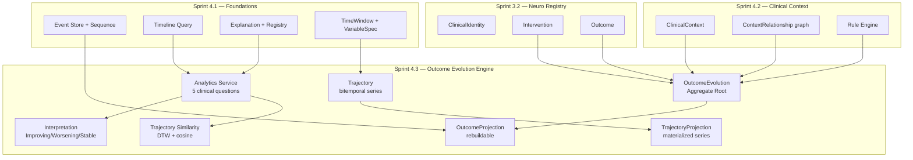

# ADR-0004 — Sprint 4.3 — Outcome Evolution Engine

> **Status:** Proposto
> **Data:** 2026-07-17
> **Sub-sprint de:** [Sprint 4 — Clinical Intelligence Platform](./vivid-snuggling-moth.md)
> **Anterior:** [Sprint 4.2 — Clinical Context Engine](./SPRINT_4_2_REPORT.md)
> **Vinculado à:** [Diretriz arquitetural AraOS — Clinical Knowledge Representation](#fundamento-filosófico)

---

## Fundamento Filosófico

A partir deste ADR, o AraOS passa a adotar formalmente a **representação computacional do conhecimento clínico** como fundamento arquitetural — não mais "Event-Sourced EMR" puro.

### Diagnóstico é interpretação, não unidade fundamental

O AraOS **não organiza seu modelo em torno de diagnósticos**.
Diagnósticos, escalas, scores, classificações e hipóteses são **interpretações derivadas** do estado coletivo de:

- **capacidades funcionais** observáveis (comunicação, sono, regulação emocional, etc.)
- **estados clínicos** (estável, em transição, em crise, em melhora)
- **contextos** ativos (Sprint 4.2)
- **evolução temporal** (séries, tendências, transições)

Um diagnóstico futuro será uma hipótese sobre como esses elementos se relacionam em uma janela temporal — não a chave primária de nada.

### Conhecimento ≠ informação

| Conceito | Informação | Conhecimento (AraOS) |
|---|---|---|
| Outcome | registro de que "X melhorou" | trajetória observável do conhecimento pós-intervenção, com contexto, evidências e explicação |
| Analytics | média e desvio padrão | resposta a perguntas clínicas causais/comparativas |
| Relação | chave estrangeira | aresta candidata do Knowledge Graph |
| Identificador | diagnóstico | capability + clinical_state + contexto |

---

## Os 6 Princípios Obrigatórios

Antes de **qualquer** feature, o time (incluindo IA) deve responder:

1. **Esta funcionalidade representa conhecimento ou apenas informação?**
   - Se apenas informação: reavaliar modelagem.
2. **Ela preserva contexto?**
   - Toda nova entidade referencia `ClinicalContext` ou `Intervention` quando aplicável.
3. **Ela preserva temporalidade?**
   - Métricas instantâneas são proibidas quando representação longitudinal for possível.
4. **Ela mantém rastreabilidade completa?**
   - `provenance_events: List[str]` é campo obrigatório em toda agregação.
5. **Ela preserva explainability?**
   - Toda inferência emite `Explanation` registrada.
6. **Ela poderá alimentar o Clinical Genome futuramente?**
   - Nenhum identificador pode depender exclusivamente de diagnóstico.

Se qualquer resposta for negativa: reavaliar modelagem **antes** de escrever código.

---

## Contexto

A Sprint 4.2 (Clinical Context Engine) entregou a camada capaz de representar **o que o paciente vive** em qualquer janela — medicação, sono, escola, crise, etc. Mas o sistema ainda **não representa a evolução do conhecimento clínico sobre o paciente ao longo do tempo**.

Hoje, o médico olha uma lista de eventos + lista plana de outcomes. Não vê:
- *Qual foi a trajetória desta capacidade ao longo de 18 meses?*
- *Quais contextos antecederam a melhora?*
- *Qual intervenção teve maior impacto?*
- *Existem trajetórias semelhantes que poderiam informar o caso?*

A Sprint 4.3 entrega essa camada. **Não é um módulo de gráficos** — é a primeira camada capaz de transformar eventos em **conhecimento longitudinal**.

---

## Decisão

Construir o **Outcome Evolution Engine** como:

1. **`OutcomeEvolution`** — Aggregate Root que carrega a **trajetória observável** do conhecimento sobre uma capacidade funcional ao longo do tempo, **nunca** apenas um resultado final.
2. **Trajectory + Interpretation** — Série temporal bitemporal + interpretação corrente (com confidence + explicação).
3. **5 perguntas clínicas canônicas** — Analytics responde perguntas causais/comparativas, não descritivas.
4. **Knowledge Graph-ready** — Toda aresta criada já nasce no formato de edge do KG futuro.
5. **Explainability obrigatória nas 6 perguntas** — toda inferência explica: por quê, com quais evidências, com quais contextos, com quais eventos, quando, com qual confiança.

---

## Bounded Context Map



---

## Modelo de Domínio

### OutcomeEvolution (Aggregate Root)

```python
@dataclass(frozen=True)
class OutcomeEvolution:
    outcome_evolution_id: str          # ULID
    tenant_id: str
    patient_id: str

    # ─── Identificação orientada a capacidades (NÃO a diagnóstico)
    capability: str                    # "communication.social" | "sleep.quality" | ...
    clinical_state: str                # "stable" | "in_transition" | "in_crisis" | "improving"

    # ─── Conhecimento longitudinal
    trajectory: Trajectory             # série temporal bitemporal
    interpretation: Interpretation     # leitura atual (with confidence)

    # ─── Relações (KG-ready)
    intervention_history: List[str]    # intervention_ids observadas
    context_dependencies: List[str]    # ClinicalContext ids ativos
    related_evolutions: List[str]      # outras OutcomeEvolution do mesmo paciente

    # ─── Rastreabilidade
    provenance_events: List[str]       # event ids que fundamentam
    baseline_value: Optional[float]
    expected_value: Optional[float]    # hipótese clínica (não fato)

    # ─── Confiança + Explicação
    confidence: float                  # 0.0–1.0
    explanation_id: Optional[str]      # SEMPRE que interpretation muda

    # ─── Audit
    created_at: datetime
    updated_at: datetime
    created_by: str
    aggregate_version: int
```

**Invariantes críticas:**

1. Identificação **nunca** depende de diagnóstico. `capability` é a chave primária semântica.
2. Toda transição de `interpretation.state` exige `reason` + `Explanation` registrada.
3. `provenance_events` é não-vazio enquanto `aggregate_version == 1`. Depois: pode permanecer como rastro histórico.
4. `baseline_value` é imutável após criação (a "fotografia inicial" do conhecimento antes de qualquer intervenção).
5. `expected_value` é hipótese clínica — registrado como `InterpretationAlternative` alternativa à `interpretation` corrente.
6. Uma OutcomeEvolution por `(tenant_id, patient_id, capability)` — unicidade enforced no DB.

### Trajectory (série bitemporal)

```python
@dataclass(frozen=True)
class TrajectoryPoint:
    event_id: str                      # event id de origem
    sequence: int                      # sequência per-tenant
    valid_time: datetime                # quando o evento CLÍNICO aconteceu
    transaction_time: datetime          # quando foi registrado
    value: float
    confidence: float                  # 0.0–1.0

@dataclass(frozen=True)
class Trajectory:
    capability: str
    points: List[TrajectoryPoint]      # ordenado por valid_time

    def segmented_around(
        self, intervention_id: str
    ) -> Tuple["Trajectory", "Trajectory"]:
        """Pré e pós-intervenção — alimenta counterfactual simples."""

    def slope(self, window: TimeWindow) -> Optional[float]:
        """Variação por dia na janela."""

    def delta(self, since: datetime) -> Optional[float]:
        """current − baseline_since."""

    def velocity(self, window: TimeWindow) -> Optional[float]:
        """slope do slope — segunda derivada."""

    def trend_label(self) -> "TrendLabel":
        """Improving / Stable / Worsening / InsufficientData."""
```

### Interpretation (leitura clínica corrente)

```python
@dataclass(frozen=True)
class Interpretation:
    interpretation_id: str
    evolution_id: str
    state: InterpretationState          # IMPROVING | STABLE | WORSENING | INSUFFICIENT_DATA
    confidence: float
    method: str                         # "slope_30d" | "delta_since_baseline" | ...
    method_version: str                 # "1.0" — permite invalidação retroativa
    reason: str                         # obrigatório — explica a transição
    alternative_interpretations: List[InterpretationAlternative]
    contributing_context_ids: List[str] # ClinicalContext (Sprint 4.2)
    contributing_event_ids: List[str]
    computed_at: datetime

class InterpretationState(str, Enum):
    IMPROVING = "improving"
    STABLE = "stable"
    WORSENING = "worsening"
    INSUFFICIENT_DATA = "insufficient_data"

@dataclass(frozen=True)
class InterpretationAlternative:
    state: InterpretationState
    confidence: float                   # menor que a interpretation principal
    reason: str
```

**Regra:** toda Interpretation.transition exige:
- `reason` preenchido (não vazio)
- `Explanation` registrada (não nula)
- Ao menos 1 `contributing_context_id` OU `contributing_event_id` (rastreabilidade)

---

## Analytics Service — 5 Perguntas Clínicas Canônicas

Analytics responde **perguntas clínicas causais/comparativas**, não estatísticas descritivas. Cada resposta é um `AnalyticsResult` + `Explanation`.

### P1 — "Como esta capacidade evoluiu?"

```python
analytics.trajectory(
    tenant_id, patient_id, capability, window
) -> TrajectoryReport
# Slope, delta desde baseline, velocity, acceleration,
# trend_label, confidence, Explanation.
```

### P2 — "Quais contextos antecederam esta melhora?"

```python
analytics.contexts_preceding(
    tenant_id, patient_id, capability,
    target_state=InterpretationState.IMPROVING,
    lookback_days=30,
) -> List[ClinicalContext]
# Query retroativa: encontra ClinicalContexts (Sprint 4.2) cuja janela
# de atividade terminou dentro de N dias antes do Improving event.
```

### P3 — "Qual intervenção apresentou maior impacto?"

```python
analytics.intervention_impact(
    tenant_id, patient_id, intervention_id
) -> ImpactReport
# segmenta Trajectory em pre/post intervention_id
# compara slope pré vs slope pós
# retorna delta, confidence (n_points-dependent), Explanation
```

### P4 — "Quais trajetórias semelhantes existem?"

```python
analytics.similar_trajectories(
    tenant_id, patient_id, capability,
    cohort_seed, distance_metric="dtw"
) -> List[SimilarTrajectory]
# DTW (Dynamic Time Warping) entre Trajectory atual e Trajectories candidatas
# retorna top-N + distância + confidence + Explanation
```

### P5 — "Quando essa interpretação foi construída e por quê?"

```python
analytics.explain_interpretation(
    tenant_id, evolution_id
) -> OutcomeExplanation  # extends Explanation
# inference_chain: ["ATEC.drop.detected", "OUTCOME_WORSENING.registered"]
# evidence_window: TimeWindow
# baseline_method: "first_quartile"
# contributing_contexts: [...]
# contributing_events: [...]
# limitations: ["n<10", "baseline<14d"]
# alternative_interpretations: [...]
```

---

## Knowledge Graph — Compatibilidade

Toda relação clínica criada nesta Sprint deve ser desenhada para tornar-se **aresta de KG** sem refatoração.

| Relação clínica hoje | Aresta futura no KG |
|---|---|
| `OutcomeEvolution.intervention_history` | `(intervention) -[:INFLUENCED]-> (outcome_evolution)` com peso = delta |
| `OutcomeEvolution.context_dependencies` | `(context) -[:EVIDENCED]-> (outcome_evolution)` |
| `OutcomeEvolution.related_evolutions` | `(outcome_evolution) -[:SIMILAR_TO]-> (outcome_evolution)` com peso = 1 - distância |
| `TrajectoryPoint.event_id` | ponto da série ↔ evento clínico no KG |
| `Interpretation.contributing_context_ids` | já nasce como edge list |

**Nenhum identificador pode depender exclusivamente de diagnóstico.** A chave de composição é `(tenant_id, patient_id, capability, window_baseline)`.

---

## Explainability — Modelo das 6 Perguntas

Toda inferência Analytics ou Transition de Interpretation deve produzir `OutcomeExplanation` que responde **as 6 perguntas**:

```python
@dataclass(frozen=True)
class OutcomeExplanation(Explanation):
    inference_chain: List[str]              # ["ATEC.drop.detected", "OUTCOME_WORSENING.registered"]
    evidence_window: TimeWindow
    baseline_method: str                   # "first_quartile" | "first_n_points" | "pre_intervention"
    contributing_context_ids: List[str]     # ClinicalContext (Sprint 4.2)
    contributing_event_ids: List[str]
    contributing_intervention_ids: List[str]
    limitations: List[str]                 # "n<10; low confidence; baseline<14d"
    alternative_interpretations: List[str] # estados alternativos com confidence
```

Cross-cutting rule (Sprint 4.1): se análise sai sem `OutcomeExplanation` → DLQ + métrica `outcomes_unexplained_total++`.

---

## Eventos de Domínio (5 novos)

Append ao catálogo (`EventProducer.INTELLIGENCE`):

| Event Type | Descrição | Payload chave |
|---|---|---|
| `OUTCOME_EVOLUTION_REGISTERED` | OutcomeEvolution criada | evolution_id, patient_id, capability, baseline_value |
| `OUTCOME_TRAJECTORY_POINT_RECORDED` | Novo ponto adicionado à série | evolution_id, point.event_id, valid_time, value |
| `OUTCOME_INTERPRETATION_REGISTERED` | Nova interpretação emitida | evolution_id, state, confidence, reason, explanation_id |
| `OUTCOME_INTERPRETATION_REVISED` | Interpretação mudou | evolution_id, from_state, to_state, reason, explanation_id |
| `OUTCOME_TRAJECTORY_COMPARED` | Comparação entre trajetórias | source_evolution_id, target_evolution_id, distance, metric |

Cada evento carrega `tenant_id`, `patient_id`, `correlation_id` herdado.

---

## SQL Persistence + Migration

`migrations/versions/2026_07_19_outcome_evolution_s43.py` encadeada após `2026_07_18_clinical_context_s42`.

```sql
CREATE TABLE outcome_evolutions (
    outcome_evolution_id VARCHAR PRIMARY KEY,
    tenant_id VARCHAR NOT NULL,
    patient_id VARCHAR NOT NULL,
    capability VARCHAR(120) NOT NULL,
    clinical_state VARCHAR(60) NOT NULL,
    baseline_value FLOAT,
    expected_value FLOAT,
    confidence FLOAT NOT NULL,
    explanation_id VARCHAR,
    created_at TIMESTAMP NOT NULL,
    updated_at TIMESTAMP NOT NULL,
    created_by VARCHAR NOT NULL,
    aggregate_version INTEGER NOT NULL DEFAULT 1,
    UNIQUE (tenant_id, patient_id, capability)
);
CREATE INDEX ix_oe_tenant_patient ON outcome_evolutions(tenant_id, patient_id);
CREATE INDEX ix_oe_capability ON outcome_evolutions(tenant_id, capability);

CREATE TABLE outcome_trajectory_points (
    point_id VARCHAR PRIMARY KEY,
    evolution_id VARCHAR NOT NULL REFERENCES outcome_evolutions(outcome_evolution_id),
    event_id VARCHAR NOT NULL,
    sequence BIGINT NOT NULL,
    valid_time TIMESTAMP NOT NULL,
    transaction_time TIMESTAMP NOT NULL,
    value FLOAT NOT NULL,
    confidence FLOAT NOT NULL,
    FOREIGN KEY (event_id, sequence) REFERENCES clinical_events(event_id, sequence)
);
CREATE INDEX ix_otp_evolution ON outcome_trajectory_points(evolution_id, valid_time);
CREATE INDEX ix_otp_event ON outcome_trajectory_points(event_id);
```

Unique constraint `(tenant_id, patient_id, capability)` evita criar 2 OutcomeEvolution paralelas para a mesma capacidade.

---

## Projections (rebuildable + idempotente)

2 projections materializadas:

1. **OutcomeProjection** — write-side sobre `outcome_evolutions` + `outcome_trajectory_points`. Idempotente via `processed_events` (Sprint 3.1).
2. **TrajectoryProjection** — read-side que mantém séries temporais materializadas + agregados (slope, delta) já calculados em janela pré-definida.

Replay bit-identical validado em `test_projection_replay.py`. Idempotência testada em 1x/2x/5x/50x/100x.

---

## REST API (10 endpoints novos)

Blueprint: `/api/intelligence/outcomes/*` (separado do Context para clareza arquitetural).

| Method | Path | Função |
|---|---|---|
| POST | `/evolutions` | Cria `OutcomeEvolution` para capability |
| GET | `/evolutions/{id}` | Recupera aggregate + trajectory + interpretation |
| GET | `/patients/{id}/evolutions` | Lista evolutions do paciente |
| GET | `/evolutions/{id}/trajectory` | Série temporal completa |
| POST | `/evolutions/{id}/recompute` | Recalcula interpretation (com reason) |
| GET | `/analytics/trajectory` | P1 |
| GET | `/analytics/contexts-preceding` | P2 |
| GET | `/analytics/intervention-impact` | P3 |
| GET | `/analytics/similar-trajectories` | P4 |
| GET | `/explanations/{id}` | P5 |

JWT + X-Tenant-ID (Sprint 4.1 padrão). 5 permissões novas.

---

## Permissões Novas

```python
class Permission:
    INTELLIGENCE_OUTCOME_READ = "intelligence.outcome.read"
    INTELLIGENCE_OUTCOME_WRITE = "intelligence.outcome.write"
    INTELLIGENCE_OUTCOME_RECOMPUTE = "intelligence.outcome.recompute"
    INTELLIGENCE_ANALYTICS_READ = "intelligence.analytics.read"
    INTELLIGENCE_ANALYTICS_QUERY = "intelligence.analytics.query"
```

---

## Padrões Reusados (não reinventar)

| Reuso | Onde | Como |
|---|---|---|
| `ClinicalEventPublisher.publish()` | `event_store/publisher.py` | Cada transition publica evento |
| `Explanation` + `ExplanationRegistry` | Sprint 4.1 | Toda Interpretation emite `OutcomeExplanation` |
| `TimelineQuery.for_patient()` | Sprint 4.1 | Analytics consome timeline para perguntas clínicas |
| `ClinicalContext` + `ContextRelationship` | Sprint 4.2 | `context_dependencies` referencia Sprint 4.2 |
| `processed_events` + idempotência | Sprint 3.1 | OutcomeProjection + TrajectoryProjection |
| `VariableSpec` | Sprint 4.1 | Trajectory.canonical_variable_spec |
| `TimeWindow` | Sprint 4.1 | Analytics queries com window explícita |
| `_resolve_tenant_id()` / `_get_actor_id()` | `routes/_helpers.py` | Novos blueprints reusam |
| `MetricsRecorder` + `METRIC_*` | Sprint 4 observability | Métricas com prefixo `outcomes_*` |
| `CorrelationContext` | Sprint 4.1 | Toda inferência propaga correlation_id |

---

## Definition of Done — Sprint 4.3

- [ ] `OutcomeEvolution` + `Trajectory` + `Interpretation` implementados como pure value objects.
- [ ] 5 event types catalogados com `OutcomeExplanation` obrigatória em transições.
- [ ] Analytics service responde **≥4 perguntas clínicas** (P1, P2, P3, P5 confirmadas; P4 design only).
- [ ] Outcome NUNCA identificável só por diagnosis — cap key = `(tenant, patient, capability)`.
- [ ] Toda nova relação já nasce KG-ready (arestas tipadas com peso/confidence).
- [ ] Replay bit-identical validado em ambas projections.
- [ ] Idempotência via `processed_events`.
- [ ] Migration encadeada com downgrade_reference.
- [ ] ≥150 testes + **≥95% cobertura**.
- [ ] Nenhuma regressão em Sprints 3.1/3.2/4.1/4.2.
- [ ] `docs/SPRINT_4_3_REPORT.md` + memory update + ADR-0004 aceito.

---

## Riscos & Mitigações

| Risco | Mitigação |
|---|---|
| Drift semântico entre `capability` textual e Outcome real | `capability` validado contra registry fechado v1; expansão requer migration |
| Trajectory vira "long line" sem janelas | Toda query exige `TimeWindow` explícita; unbounded queries retornam 400 |
| DTW similarity vira hotspot em produção | Limite `n_candidates` + cache por `(evolution_id, candidate_id)`; sem ML |
| Explainability "boilerplate" semanticamente vazio | `alternatives` obrigatórias; audit log flag se `reason` for genérico |
| Identificador vazar diagnóstico (e.g., `capability = "tea_communication"`) | `capability` enum/registry com allowlist v1; validator na rota |

---

## Próximas Sprints que dependem desta

- **4.4 — Cohort + Correlation + Research:** Similar_trajectories (P4) vira critério de cohort builder.
- **4.5 — Dashboard Engine:** Dashboard paciente compõe Timeline + Context + Outcome Evolution.
- **Futuro — Clinical Genome:** KG com arestas já populadas por 4.3 + 4.4.

---

## Aprovação

| Papel | Nome | Data |
|---|---|---|
| Chief AI Architect | Claude | 2026-07-17 |
| Arquiteto Clínico | (a preencher) | (a preencher) |
| Product Owner | (a preencher) | (a preencher) |
