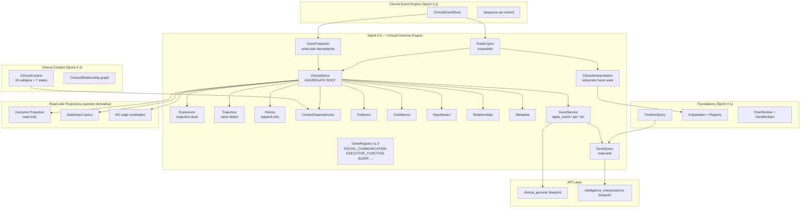

# ADR-0005 — Sprint 4.3 — Clinical Genome Engine (1ª Iteração)

> **Status:** ACCEPTED
> **Data:** 2026-07-17
> **Sub-sprint de:** [Sprint 4 — Clinical Intelligence Platform](./vivid-snuggling-moth.md)
> **Anterior:** [Sprint 4.2 — Clinical Context Engine](./SPRINT_4_2_REPORT.md)
> **Vinculado a:** [ADR-0004 — Outcome Evolution Engine](./REDACTED.md) (mantido como histórico da transição conceitual)
> **Supersede:** o **eixo conceitual** da Sprint 4.3 (Outcome-centric → Genome-centric). ADR-0004 não é modificado; é preservado como documento histórico do raciocínio que produziu o pivot.
> **Registry Version:** Clinical Gene Registry v1.0 (fixado por esta ADR)
> **Linguagem Ubíqua consolidada:** ver §"Definições Oficiais" ao final deste documento.

---

## Fundamento — Por que pivot?

Durante a elaboração da Sprint 4.3 com o modelo Outcome Evolution Engine,
identificou-se um problema conceitual profundo:

> **Outcome não é uma entidade canônica. Outcome é uma interpretação
> derivada do estado do conhecimento clínico.**

Se Outcome permanece canônico, ele:

1. **Congela o modelo no vocabulário de uma escala** (mCHAT, CARS2, ATEC…) —
   em vez de representar *o que mudou no paciente*, o sistema representa
   *o que mudou na escala*.
2. **Confunde observação com julgamento** — uma queda em CARS2 é uma
   observação sobre um instrumento, não sobre a comunicação social.
3. **Torna o modelo refém de taxonomias externas** — DSM, CID, escalas
   proprietárias. Cada nova taxonomia exige migração.

A consolidação teórica do **Clinical Genome** inverte o eixo:

- **Clinical Gene** = menor unidade funcional de conhecimento capaz de
  representar um aspecto observável da condição clínica de um indivíduo,
  preservando sua evolução temporal, contexto, evidências, grau de
  confiança e relações com outros Clinical Genes.
- **Clinical Genome** = estado coletivo dos Clinical Genes de um paciente.
  Conceito arquitetural reconstruído. **Não é Aggregate Root nesta Sprint.**
- **Outcome** = projeção derivada do estado do Genome. Read-only. Sempre
  reconstruível. **Nunca canônico.**

A Sprint 4.3 muda seu foco: de "Outcome Evolution Engine" para
"**Clinical Genome Engine (1ª Iteração)**". O objetivo deixa de ser
apenas acompanhar outcomes. Passa a ser **construir a infraestrutura
capaz de atualizar continuamente o estado do Genome**.

Nada é descartado. Toda infraestrutura já entregue vira *sustentáculo*
do Genome (ver § "Destino dos componentes já implementados").

---

## Decisão Arquitetural

### 1. Aggregate Root = `ClinicalGene`

> Nesta Sprint NÃO criar `ClinicalGenome` como Aggregate Root. O Genome
> representa apenas o estado coletivo dos Genes. Portanto, inicialmente
> o Genome **não é um Aggregate**. É um conceito arquitetural reconstruído
> a partir dos Clinical Genes.

Cada Gene é completamente independente. Identidade:

```
(tenant_id, patient_id, clinical_gene_id)
```

`clinical_gene_id` vem do **Gene Registry** (ver § 3). Capabilities
(como "comunicação", "regulação emocional", "sono") tornam-se
**características semânticas do Gene**, não sua chave primária.

### 2. Componentes do ClinicalGene

```
ClinicalGene
├── Expression              # estado observável atual (snapshot)
├── Trajectory              # evolução longitudinal bitemporal
├── History                 # append-only, audit chain
├── ContextDependencies     # ClinicalContext ids que afetam este Gene
├── Evidence                # event_ids que fundamentam o estado atual
├── Confidence              # 0.0–1.0 (sempre explícito)
├── Hypotheses              # interpretações alternativas com peso
├── Relationships           # arestas KG-ready para outros Genes
└── Metadata                # labels, capabilities, observações livres
```

**Nenhum desses componentes pertence ao Outcome.** Todos pertencem ao Gene.

### 3. Gene Registry (obrigatório)

Conjunto **fechado e versionado** de Clinical Genes conhecidos.
**Versão desta listagem:** Registry v1.0 (ver §6 — versionamento explícito).

| Gene ID | Descrição | Funções Semânticas |
|---|---|---|
| `SOCIAL_COMMUNICATION` | Comunicação social | communication, language, social |
| `EXECUTIVE_FUNCTION` | Funções executivas | attention, planning, flexibility |
| `SLEEP` | Sono (função clínica fundamental) | sleep, circadian, rest |
| `LANGUAGE` | Linguagem expressiva e receptiva | language, communication |
| `EMOTIONAL_REGULATION` | Regulação emocional | emotion, affect, self-regulation |
| `ANXIETY_REGULATION` | Regulação da ansiedade | anxiety, worry, fear |
| `MOBILITY` | Mobilidade funcional | motor, coordination, gait |

> **Princípio de nomenclatura dos Genes (v1.0):** Clinical Genes representam
> **Funções Clínicas Fundamentais**. Eles **não** representam qualidade,
> gravidade, intensidade ou desfechos. Qualidade, intensidade, desempenho
> e evolução pertencem à Clinical Expression.
>
> Ex.: `SLEEP` (função) ≠ "qualidade do sono" (descrição da Expression);
> `ANXIETY_REGULATION` (função) ≠ "nível de ansiedade" (descrição da
> Expression).

O Registry é fonte da verdade para `clinical_gene_id`. Não é tabela
configurável pelo usuário nesta Sprint — é seed versionado.

### 4. Clinical Gene Registry — Versionamento Explícito (v1.0)

A listagem de Clinical Genes é **versionada explicitamente**:

```
Clinical Gene Registry
Version 1.0
```

- O número de versão é parte da identidade semântica do Registry.
- Persistido em `clinical_gene_registry_versions` (tabela de controle)
  contendo: `version`, `effective_from`, `gene_ids_json`, `created_by`.
- Toda referência a `clinical_gene_id` carrega implicitamente a versão
  do Registry sob a qual foi criada — garantindo **rastreabilidade
  científica, reprodutibilidade e compatibilidade entre estudos e versões
  da plataforma**.
- Mudanças incrementais (adição/renomeação de Gene) → `Registry 1.1`,
  `Registry 1.2`, etc.
- Mudanças incompatíveis (reorganização conceitual) → `Registry 2.0`.
- Genes introduzidos em versões futuras **não substituem** os anteriores;
  coexistem com marcação de versão.

A primeira versão (`Registry 1.0`) é fixada por esta ADR e corresponde
exatamente à listagem em §3.

### 5. Outcome deixa de ser entidade de domínio

> Outcome passa a ser exclusivamente uma Projection. Read-only. Sempre
> reconstruível. Sempre derivado. Nunca canônico.

A `araos/clinical/outcomes/` (Sprint 4.3 original) **permanece como
read-side projection**, agora alimentada pelo estado do Clinical Genome
— não pelo registro bruto de Outcome.

### 6. Clinical Trajectory deixou de ser entidade própria

> Trajectory passa a ser componente interno do Gene. Responsável pela
> evolução longitudinal da Expression.

`ClinicalTrajectory` (Sprint 4.3 original como Aggregate) é **removido
como entidade**. Vira value object complexo dentro de
`ClinicalGene.trajectory`, com sua própria estrutura de pontos,
mudanças de regime e invariantes.

### 7. Clinical Interpretation interpreta Gene, não Outcome

> Interpretations deixam de interpretar Outcomes. Interpretam o estado
> atual do Gene. Uma alteração da Expression pode gerar uma nova
> Clinical Interpretation.

A Interpretation agora **carrega o gene_id como chave obrigatória** e
descreve uma leitura sobre o estado atual daquele Gene — não sobre um
Outcome histórico.

---

## Bounded Context Map



---

## Fluxo Canônico

```
Clinical Event
   ↓
Clinical Context (Sprint 4.2 — alimentador)
   ↓
Rule Engine identifica Gene(s) afetado(s)
   ↓
Para cada Gene afetado:
   ├── atualiza Expression (snapshot atual)
   ├── atualiza Trajectory (append point)
   ├── atualiza History (audit chain)
   ├── recalcula Hypotheses (interpretações alternativas)
   └── registra Evidence (event_ids)
   ↓
Recalcula Confidence agregado
   ↓
Emite Clinical Interpretation (opcional, por mudança significativa)
   ↓
Reconcilia estado coletivo do Genome (conceito, não aggregate)
   ↓
Deriva Outcome (projection read-only)
   ↓
Atualiza read-side projections (Dashboard, KG, Research)
   ↓
Event Store permanece source-of-truth para reconstrução
```

> **Nenhuma projeção modifica diretamente o Genome. O Genome é sempre
> reconstruído a partir dos eventos.**

---

## Rule Engine Expandido (Sprint 4.3)

Ao receber um evento clínico, o Rule Engine estendido responde:

1. **Qual Clinical Gene foi afetado?**
2. **Como sua Expression muda?** (snapshot atual → novo snapshot)
3. **A Trajectory precisa ser atualizada?** (append point, regime change?)
4. **A Interpretation mudou?** (gera nova Clinical Interpretation?)
5. **Há novos Outcomes derivados?** (NÃO canônicos)
6. **Quais projeções precisam ser atualizadas?** (Dashboard, KG, Context, Timeline)

Essas 6 perguntas são **invariantes arquiteturais**: toda feature de
inteligência passa a responder antes de ser escrita.

---

## Modelo de Domínio

### GeneRegistry (seed versionado)

```python
class ClinicalGeneId(str, Enum):
    SOCIAL_COMMUNICATION = "SOCIAL_COMMUNICATION"
    EXECUTIVE_FUNCTION = "EXECUTIVE_FUNCTION"
    SLEEP = "SLEEP"
    LANGUAGE = "LANGUAGE"
    EMOTIONAL_REGULATION = "EMOTIONAL_REGULATION"
    ANXIETY_REGULATION = "ANXIETY_REGULATION"
    MOBILITY = "MOBILITY"
```

> **Registry v1.0 fixado.** Mudanças de vocabulário devem incrementar a
> versão do Registry (1.1, 1.2, 2.0…) — ver §6.

Cada Gene tem `metadata.clinical_functions: List[str]` (ex:
`SOCIAL_COMMUNICATION` carrega `["communication", "language", "social"]`).
**`capabilities` é terminologia legada; novo nome canônico é
`clinical_functions`**. O domínio **NÃO** usa mais `capability` como
identidade (ver §"Definições Oficiais").

### ClinicalGene (Aggregate Root)

```python
@dataclass(frozen=True)
class ClinicalGene:
    gene_id: str                          # ClinicalGeneId
    tenant_id: str
    patient_id: str

    expression: Expression                # snapshot atual
    trajectory: Trajectory                # evolução longitudinal
    history: History                      # append-only audit chain
    context_dependencies: List[str]       # ClinicalContext ids
    evidence: List[str]                   # event_ids
    confidence: float                     # 0.0–1.0 (sempre explícito)
    hypotheses: List[Hypothesis]          # interpretações alternativas
    relationships: List[GeneRelationship] # KG-ready edges
    metadata: GeneMetadata                # clinical_functions + labels livres

    version: int                          # aggregate version
    created_at: datetime
    updated_at: datetime
    created_by: str

class Trend(str, Enum):
    """Vocabulário controlado para trend da Expression."""
    IMPROVING = "improving"
    STABLE = "stable"
    DECLINING = "declining"
    OSCILLATING = "oscillating"
    UNKNOWN = "unknown"

class Volatility(str, Enum):
    """Vocabulário controlado para volatilidade observada."""
    LOW = "low"
    MEDIUM = "medium"
    HIGH = "high"

@dataclass(frozen=True)
class ClinicalExpression:
    """Estado observável atual do Gene — composição estruturada.

    O "estado" do Gene é **derivado da composição** destes atributos.
    Não existe string livre representando estado.
    """
    value: float                                 # estado quantitativo atual (ex: 0.74)
    trend: Trend                                 # vocabulário controlado
    confidence: float                            # 0.0–1.0 (sempre explícito)
    volatility: Volatility                       # vocabulário controlado
    interpretation: str                          # leitura humana (NÃO canônica)
    updated_at: datetime                         # timestamp da última atualização
    explanation_reference: Optional[str] = None  # id de Explanation (Sprint 4.1)

    def __post_init__(self) -> None:
        if not (0.0 <= self.confidence <= 1.0):
            raise ValueError("confidence deve estar em [0.0, 1.0]")

class Trajectory:
    points: List[TrajectoryPoint]         # bitemporal (valid_time, transaction_time, value)

class TrajectoryPoint:
    valid_time: datetime
    transaction_time: datetime
    expression_snapshot: Expression
    contributing_event_ids: List[str]

class Hypothesis:
    hypothesis_id: str
    description: str
    weight: float                         # 0.0–1.0
    supporting_event_ids: List[str]
    confidence: float

class GeneRelationship:
    target_gene_id: str
    relationship_type: str                # "influences", "co_occurs_with",
                                          #  "precedes", "antagonizes", "amplifies"
    confidence: float
    evidence_event_ids: List[str]

class HistoryEntry:
    sequence: int
    event_id: str
    occurred_at: datetime
    summary: str
```

### GeneService

```python
class GeneService(ABC):
    def apply_event(self, tenant_id: str, patient_id: str,
                    gene_id: str, event: ClinicalEvent) -> ClinicalGene: ...
    def get(self, tenant_id: str, patient_id: str,
            gene_id: str) -> Optional[ClinicalGene]: ...
    def list_for_patient(self, tenant_id: str,
                         patient_id: str) -> List[ClinicalGene]: ...
    def get_trajectory(self, tenant_id: str, patient_id: str,
                       gene_id: str) -> Trajectory: ...
    def get_relationships(self, tenant_id: str, patient_id: str,
                          gene_id: str) -> List[GeneRelationship]: ...
```

---

## Eventos Novos (Sprint 4.3 — 6 event types)

| Event Type | Descrição | Producer |
|---|---|---|
| `CLINICAL_GENE_OBSERVED` | Nova observação de Expression | INTELLIGENCE |
| `CLINICAL_GENE_TRAJECTORY_POINT` | Append point na Trajectory | INTELLIGENCE |
| `CLINICAL_GENE_HYPOTHESIS_ADDED` | Nova Hypothesis registrada | INTELLIGENCE |
| `CLINICAL_GENE_HYPOTHESIS_REMOVED` | Hypothesis descartada | INTELLIGENCE |
| `CLINICAL_GENE_RELATIONSHIP_LINKED` | Edge KG-ready criada entre Genes | INTELLIGENCE |
| `REDACTED` | Edge removida | INTELLIGENCE |

Cada evento carrega `payload` completo para reconstrução bit-identical
do Gene. Idempotência via `processed_events` (Sprint 3.1).

---

## Schema SQL (Sprint 4.3 — 1 migration)

```sql
CREATE TABLE clinical_genes (
    gene_id              TEXT NOT NULL,         -- ClinicalGeneId enum value
    tenant_id            TEXT NOT NULL,
    patient_id           TEXT NOT NULL,
    version              INTEGER NOT NULL DEFAULT 1,
    expression_state     TEXT NOT NULL,
    expression_measured_at TIMESTAMP NOT NULL,
    expression_raw_value REAL,
    expression_unit      TEXT,
    expression_observation TEXT,
    confidence           REAL NOT NULL DEFAULT 1.0,
    capabilities_json    TEXT NOT NULL,         -- ["communication", "language"]
    metadata_json        TEXT NOT NULL DEFAULT '{}',
    created_by           TEXT NOT NULL,
    created_at           TIMESTAMP NOT NULL,
    updated_at           TIMESTAMP NOT NULL,
    PRIMARY KEY (tenant_id, patient_id, gene_id)
);

CREATE TABLE clinical_gene_trajectory_points (
    id                   INTEGER PRIMARY KEY AUTOINCREMENT,
    tenant_id            TEXT NOT NULL,
    patient_id           TEXT NOT NULL,
    gene_id              TEXT NOT NULL,
    valid_time           TIMESTAMP NOT NULL,
    transaction_time     TIMESTAMP NOT NULL,
    expression_state     TEXT NOT NULL,
    expression_value     REAL,
    contributing_event_ids_json TEXT NOT NULL,  -- JSON array
    FOREIGN KEY (tenant_id, patient_id, gene_id)
      REFERENCES clinical_genes(tenant_id, patient_id, gene_id)
);

CREATE INDEX idx_traj_gene
  ON clinical_gene_trajectory_points(tenant_id, patient_id, gene_id, valid_time);

CREATE TABLE clinical_gene_history (
    id                   INTEGER PRIMARY KEY AUTOINCREMENT,
    tenant_id            TEXT NOT NULL,
    patient_id           TEXT NOT NULL,
    gene_id              TEXT NOT NULL,
    sequence             INTEGER NOT NULL,
    event_id             TEXT NOT NULL,
    occurred_at          TIMESTAMP NOT NULL,
    summary              TEXT NOT NULL
);

CREATE INDEX idx_history_gene
  ON clinical_gene_history(tenant_id, patient_id, gene_id, sequence);

CREATE TABLE clinical_gene_relationships (
    id                   INTEGER PRIMARY KEY AUTOINCREMENT,
    tenant_id            TEXT NOT NULL,
    patient_id           TEXT NOT NULL,
    source_gene_id       TEXT NOT NULL,
    target_gene_id       TEXT NOT NULL,
    relationship_type    TEXT NOT NULL,         -- "influences" | "co_occurs_with" | ...
    confidence           REAL NOT NULL,
    evidence_event_ids_json TEXT NOT NULL,
    created_at           TIMESTAMP NOT NULL
);

CREATE INDEX idx_rel_gene
  ON clinical_gene_relationships(tenant_id, patient_id, source_gene_id);

CREATE TABLE clinical_gene_hypotheses (
    hypothesis_id        TEXT PRIMARY KEY,
    tenant_id            TEXT NOT NULL,
    patient_id           TEXT NOT NULL,
    gene_id              TEXT NOT NULL,
    description          TEXT NOT NULL,
    weight               REAL NOT NULL,
    supporting_event_ids_json TEXT NOT NULL,
    confidence           REAL NOT NULL,
    created_at           TIMESTAMP NOT NULL
);
```

Migration: `migrations/versions/2026_07_19_clinical_genome_s43.py`
encadeada após `2026_07_18_clinical_context_s42`.

---

## REST API (8 endpoints)

Blueprint: `/api/genome` registrado em `app_cors_livre.py`.

| Method | Path | Função |
|---|---|---|
| GET | `/patients/{patient_id}/genes` | Lista Genes do paciente |
| GET | `/patients/{patient_id}/genes/{gene_id}` | Recupera Gene específico |
| GET | `/patients/{patient_id}/genes/{gene_id}/trajectory` | Trajetória bitemporal |
| GET | `/patients/{patient_id}/genes/{gene_id}/hypotheses` | Hypotheses ativas |
| GET | `/patients/{patient_id}/genes/{gene_id}/relationships` | KG-ready edges |
| GET | `/patients/{patient_id}/genes/{gene_id}/history` | Audit chain do Gene |
| POST | `/patients/{patient_id}/genes/{gene_id}/observations` | Aplica evento clínico (manual ou processado) |
| GET | `/patients/{patient_id}/genome` | Snapshot coletivo (concatena Genes — concept, não aggregate) |

Auth: `@jwt_required()` + `X-Tenant-ID`. Tenant isolation estrita.

---

## Permissões Novas (Sprint 4.3)

```python
class Permission:
    INTELLIGENCE_GENE_READ = "intelligence.gene.read"
    INTELLIGENCE_GENE_WRITE = "intelligence.gene.write"
    INTELLIGENCE_GENE_OBSERVE = "intelligence.gene.observe"
    INTELLIGENCE_GENOME_READ = "intelligence.genome.read"
```

`INTELLIGENCE_GENE_WRITE` é exclusivo para roles clínicas qualificadas.
`INTELLIGENCE_GENE_OBSERVE` pode ser delegado a sistemas externos
(coletores de eventos) com confirmação humana posterior.

---

## Destino dos Componentes Já Implementados

| Componente | Novo papel |
|---|---|
| Event Store | Source of Truth para reconstrução do Clinical Genome |
| Timeline | Infraestrutura temporal do Gene (Trajectory = Timeline especializada) |
| Clinical Context | Alimentador do Genome (ContextDependencies) |
| Rule Engine | Identifica quais Genes são afetados pelos eventos |
| Explanation Engine | Explica alterações de Expressions e Interpretações |
| Outcome | Read Model derivado (projection read-only) |
| Processed Events | Idempotência para GeneProjection |

Nenhuma decisão arquitetural anterior é invalidada. Todas alimentam o
Clinical Genome.

---

## Outcome como Projection (esclarecimento)

`araos/clinical/outcomes/` (módulo do plano original) **permanece como
read-side projection**. Agora alimentado pelo estado do Genome:

```python
class OutcomeView:                      # Read model only
    outcome_id: str
    tenant_id: str
    patient_id: str
    source_gene_id: str                 # gene que originou o outcome
    derived_at: datetime
    derived_state: str
    evidence_event_ids: List[str]
    confidence: float
```

`OutcomeView` é construído por uma projection que consome eventos
`CLINICAL_GENE_*` e recomputa uma visão orientada a Outcome. **Não há
write-side para OutcomeView.** É sempre rebuildable a partir do Genome.

---

## Critérios de Aceitação / DoD

- [ ] Gene Registry versionado com 7 genes iniciais (tabela acima).
- [ ] `ClinicalGene` Aggregate Root com 9 componentes internos.
- [ ] `GeneService.apply_event()` determinístico (replay bit-identical).
- [ ] `GeneProjection` write-side idempotente via `processed_events`.
- [ ] 6 eventos novos no catálogo (event_store/catalog.py).
- [ ] 1 migration Alembic encadeada após `2026_07_18_clinical_context_s42`.
- [ ] Rule Engine expandido responde as 6 perguntas para qualquer evento.
- [ ] OutcomeView como projection read-only (NÃO write-side).
- [ ] OutcomeView é rebuildable a partir de `clinical_genes` + eventos.
- [ ] 8 endpoints REST com JWT + tenant isolation.
- [ ] 4 novas permissões adicionadas.
- [ ] Trajectory é value object interno (NÃO entidade).
- [ ] Interpretation carrega `gene_id` obrigatório.
- [ ] Cobertura ≥95% em `araos/clinical/genome/`.
- [ ] Testes de invariante: Gene inexistente no Registry → rejeitado.
- [ ] Testes de invariante: Clinical Function NÃO pode ser chave primária do Gene.
- [ ] Testes de invariante: ClinicalExpression sem string livre de estado — composição obrigatória.
- [ ] Testes de invariante: OutcomeView.write → bloqueado.
- [ ] Testes de invariante: registry_version persistido em toda referência a gene.
- [ ] Testes property-based: Hypothesis weights ∈ [0,1].
- [ ] Testes property-based: Trajectory append-only (sem retro-edição).
- [ ] Testes property-based: Expression.trend ∈ vocabulário controlado.
- [ ] Testes property-based: Expression.volatility ∈ vocabulário controlado.
- [ ] Testes property-based: Expression.confidence ∈ [0,1].

---

## Explicitamente Fora de Escopo (Sprint 4.3 — 1ª Iteração)

- Dashboard Engine (Sprint 4.4+)
- Research Workspace (Sprint 4.5+)
- Knowledge Graph materializado (Sprint 4.5+)
- Decision Engine / ML (Sprint 5+)
- Correlation Engine entre Genes (Sprint 4.4+)
- Genome como Aggregate Root (decisão arquitetural de médio prazo;
  explicitamente adiada para preservar isolamento entre Genes nesta
  iteração)

Esses módulos dependerão da estabilidade do modelo do Gene.

---

## Definições Oficiais (Linguagem Ubíqua Consolidada)

Esta seção é a **referência canônica** para toda a documentação, código
e comunicação relacionados ao Clinical Genome. Qualquer divergência
deve ser tratada como dívida técnica e corrigida.

### Clinical Gene

> **Clinical Gene representa uma Função Clínica Fundamental cuja
> expressão pode variar ao longo do tempo em resposta a eventos
> clínicos, preservando contexto, evidências, temporalidade,
> rastreabilidade e explicabilidade.**

- É a **unidade fundamental** do conhecimento clínico no AraOS.
- Cada Gene é semanticamente **estável** ao longo do tempo.
- Sua **dinâmica** é descrita pela Clinical Expression.
- Sua identidade é `(tenant_id, patient_id, clinical_gene_id)`.
- `clinical_gene_id` vem do **Clinical Gene Registry v1.0**.
- Genes **não** representam qualidade, gravidade, intensidade ou
  desfechos — esses pertencem à Expression.

### Clinical Gene Registry

> Catálogo **fechado e versionado** de Clinical Genes conhecidos.
> **Versão atual: 1.0.**

- Fornece os `clinical_gene_id` válidos no sistema.
- Versionamento SemVer (1.0, 1.1, 1.2 … 2.0 …).
- Persistido em `clinical_gene_registry_versions`.
- Genes introduzidos em versões futuras coexistem com versões
  anteriores; jamais são sobrescritos.

### Clinical Function

> Função semântica à qual um Gene pode estar associado, usada para
> classificação, busca e correlação clínica.

- **Substitui o termo legado `capability`** em toda a documentação
  de domínio.
- Exemplos: `communication`, `language`, `sleep`, `attention`,
  `motor`, `emotion`.
- Um Gene carrega uma lista de Clinical Functions em
  `metadata.clinical_functions`.
- Clinical Function **NÃO é identidade** do Gene. Apenas o
  `clinical_gene_id` (vindo do Registry) é identidade.

### Clinical Expression

> Estado observável **atual** de um Clinical Gene, representado por
> composição estruturada.

Campos canônicos (todos obrigatórios):

| Campo | Tipo | Descrição |
|---|---|---|
| `value` | float | estado quantitativo atual (ex: `0.74`) |
| `trend` | Trend (enum) | `improving` / `stable` / `declining` / `oscillating` / `unknown` |
| `confidence` | float ∈ [0,1] | grau de confiança explícito |
| `volatility` | Volatility (enum) | `low` / `medium` / `high` |
| `interpretation` | str | leitura humana **não canônica** |
| `updated_at` | datetime | timestamp da última atualização |
| `explanation_reference` | Optional[str] | id de `Explanation` (Sprint 4.1) |

> **Não existe string livre representando "estado" do Gene.** O estado
> é sempre derivado da composição acima.

### Capability (terminologia legada)

> **Capability deixa de representar a identidade do domínio.**
> Permanece apenas em conceitos herdados do modelo antigo ou em
> componentes estritamente técnicos (ex: nomes de campo em APIs
> externas, integrações). **Não é conceito central do domínio.**

Substituir `capability` por `Clinical Function` ou `Clinical Gene`
sempre que possível.

### Clinical Context

> Contexto clínico relevante para a evolução longitudinal do paciente
> (medicação, sono, escola, família, fase comportamental, etc.).
> **Alimentador do Genome** (não substitui).

Sprint 4.2 — ADR-0003.

### Clinical Genome

> Estado coletivo dos Clinical Genes de um paciente. Conceito
> arquitetural reconstruído a partir dos Genes. **Não é Aggregate
> Root nesta Sprint.**

Decisão de médio prazo. Nesta Sprint, o Genome é **derivado** por
composição: ler todos os Genes do paciente e agregar.

### Clinical Interpretation

> Leitura do estado funcional atual de um Gene. Interpreta o Gene,
> não o Outcome.

- Gerada opcionalmente quando a Expression muda significativamente.
- Carrega `gene_id` obrigatório.

### Outcome

> **Projeção derivada do estado do Genome.** Read-only. Sempre
> reconstruível. Nunca canônico.

- Sem write-side.
- `OutcomeView` é sempre rebuildable a partir de `clinical_genes` +
  eventos `CLINICAL_GENE_*`.

### State

> ❌ **Não usar string livre para representar estado de Gene.**
>
> O estado é sempre derivado da composição da Clinical Expression
> (`value` + `trend` + `confidence` + `volatility` + `interpretation`
> + `updated_at` + `explanation_reference`).

### Sleep Quality → Sleep

> `SLEEP_QUALITY` foi renomeado para `SLEEP` no Registry v1.0.
>
> `SLEEP` é a função clínica fundamental; "qualidade do sono" é
> descrição da Expression, não identidade do Gene.

### Anxiety → Anxiety Regulation

> `ANXIETY` foi renomeado para `ANXIETY_REGULATION` no Registry v1.0.
>
> `ANXIETY_REGULATION` é a função clínica fundamental; "nível de
> ansiedade" é descrição da Expression, não identidade do Gene.

---

## Regra Arquitetural Permanente

Antes de qualquer decisão de modelagem, responder obrigatoriamente:

> **"Esta decisão fortalece o Clinical Gene como a unidade
> fundamental da representação computacional do conhecimento clínico?"**

Caso a resposta seja negativa, revisar a modelagem **antes** da
implementação.

---

## Visão do Projeto

> O AraOS não está sendo desenvolvido como um prontuário eletrônico
> inteligente.
>
> O objetivo do projeto é construir uma **infraestrutura computacional
> para representação, evolução, inferência e interpretação do
> conhecimento clínico**.

Nesse modelo:

- **Clinical Gene** — unidade fundamental do conhecimento.
- **Clinical Genome** — estado canônico do paciente.
- **Clinical Expression** — dinâmica desse conhecimento.
- **Clinical Interpretation** — leitura do estado funcional atual.
- **Outcomes, Dashboards, Analytics, Inteligência Artificial,
  Pesquisa e Knowledge Graph** — projeções derivadas desse modelo.

Toda evolução futura da plataforma deverá preservar essa hierarquia
conceitual.

---

## Próximas Sprints

- **Sprint 4.4** — Correlation Engine entre Genes + Cohort Builder +
  Research Workspace export (consome Genome state).
- **Sprint 4.5** — Knowledge Graph materializado + Dashboard Engine +
  ML Preparation interfaces (consome Genome state).
- **Sprint 5+** — Genome como Aggregate Root (decisão arquitetural de
  médio prazo, condicionada à estabilidade do modelo).