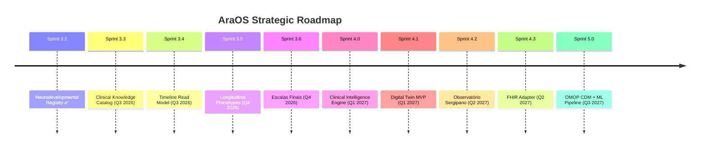

# Future-Proofing — Como o AraOS suporta o amanhã

**Status:** 📐 Visão arquitetural
**Data:** 2026-07-16

> A Sprint 3.2 é a fundação. Este documento descreve **como ela habilita** os
> próximos grandes eixos do AraOS: Clinical Intelligence Engine, Digital Twin,
> Observatório Sergipano de Neurodesenvolvimento, Pesquisa Clínica, Machine Learning,
> Predição, Dashboards, Coortes, FHIR, OpenEHR e OMOP CDM.

---

## Princípios Norteadores

### 1. Event Sourcing como ADN

O Clinical Event Store é **append-only, imutável, com hash chain canônico**.
Toda informação clínica é derivada de eventos. Isso nos dá:

- **Replay completo** do histórico de qualquer paciente.
- **Time travel** — queries em qualquer ponto da história (`as_of_sequence`).
- **Audit trail** total — base regulatória (LGPD, HIPAA, GDPR).
- **Testabilidade** — qualquer cenário clínico é reproduzível.

### 2. Projection Layer Extensível

Novas projeções podem ser adicionadas **sem tocar o domain layer**:

```python
# Adicionar nova projeção (ex: Timeline read model)
class TimelineProjection:
    def apply(self, event):
        ...

# Adicionar ao consumer
projections = [
    REDACTED(),  # existente
    TimelineProjection(),                     # novo, Sprint 3.4
    LongitudinalPhenotypeSnapshot(),          # novo, Sprint 3.5
]
```

### 3. Domain Events como Contratos Públicos

Os 25 Domain Events publicados hoje são **API de integração** estável.
Adicionar novo consumer (FHIR, ML, research) = apenas subscribe no Event Bus.

---

## Eixos Estratégicos Habilitados

### 🧠 Clinical Intelligence Engine

**O que é:** Camada de análise clínica que processa eventos em tempo real,
detecta padrões, sugere hipóteses.

**Como é habilitado:**

- Domain Events já carregam `phenotype_code`, `severity`, `linked_diagnosis_ids`.
- Replay por `aggregate_id` permite análise longitudinal completa.
- Projection Layer suporta adicionar nova projeção `IntelligenceInsightsProjection`.

**Exemplo de uso (Sprint futura):**
```python
class IntelligenceInsightsProjection:
    """Detecta padrões como 'comorbidade TDAH em pacientes TEA'."""
    def apply(self, event):
        if event.event_type == "DIAGNOSIS_CONFIRMED":
            self._update_comorbidity_index(event.patient_id)
```

### 👥 Digital Twin

**O que é:** Representação digital longitudinal do paciente para simulação
de cenários (ex: "se iniciar medicação X, qual desfecho esperado?").

**Como é habilitado:**

- ClinicalIdentity é o pivot — todas as entidades referenciam.
- Multi-classificação simultânea suporta comorbidades.
- Outcomes registram feedback do mundo real → treina modelo preditivo.
- Replay permite "replay" de vida clínica para validação.

**Estrutura (futura):**
```
DigitalTwin(patient_id)
    ├── snapshot_at(sequence) → state em qualquer ponto
    ├── predict(outcome_type) → ML inference
    └── simulate(intervention) → counterfactual
```

### 🇧🇷 Observatório Sergipano de Neurodesenvolvimento

**O que é:** Plataforma de vigilância epidemiológica e pesquisa populacional
sobre TEA/TDAH/outros em Sergipe.

**Como é habilitado:**

- Schema `observatorio_neuro` separado (cross-tenant) agrega dados agregados.
- Anonimização automática via projection layer (sem PII no observatório).
- Queries cross-tenant permitidas apenas para role `OBSERVATORY_RESEARCHER`.
- Cohort builder baseado em DiagnosisConfirmed + Outcome events.

**Separação:**
```
araos.specialties.neurodevelopmental.*    → clinical (per-tenant)
araos.observatory.neuro.*                  → research (cross-tenant, anonimizado)
```

### 🔬 Pesquisa Clínica

**Habilita:**
- Cohort definition via eventos (sem schema adicional).
- Retrospective studies: replay events entre `sequence_a` e `sequence_b`.
- Prospective studies: subscription a event types específicos.
- Statistische analysis: Python notebooks consomem eventos via API read-only.

**API research-ready:**
```
GET /api/research/cohorts/preview?criteria=...
GET /api/research/events?since_sequence=&until_sequence=
GET /api/research/aggregates/by_diagnosis?icd=F84
```

### 🤖 Machine Learning & Predição

**Datasets naturais:**
- Cada evento é um sample com timestamp.
- Diagnosis + Outcome = label para supervised learning.
- Phenotype + Intervention = feature engineering direta.
- Patient journey = sequence model input (transformers).

**Pipeline ML-ready:**
```python
# Training data extraction
dataset = EventStore.query(
    event_types=["DIAGNOSIS_CONFIRMED", "OUTCOME_*"],
    as_features=...,  # feature engineering
    as_labels=...,    # target
)
# → train model → deploy via MLflow → integrate into AraOS
```

**Predição (futuro):**
```
POST /api/predictions/diagnosis_risk
→ based on phenotype_codes + assessments → probability + confidence
```

### 📊 Dashboards & Coortes

**Dashboards clínicos:**
- Drill-down: cohort → patient → events → entity.
- Real-time updates via Event Bus (WebSocket).
- Materialized views por pre-computation (NightlyBatch).

**Cohort builder:**
```
Cohort(
    criteria=[
        DiagnosisConfirmed(condition="TEA_F84.0"),
        AssessmentApplied(scale="MCHAT_R_F", score__gt=8),
        InterventionStarted(type="MEDICATION"),
    ],
    timeframe=between("2024-01-01", "2026-12-31"),
)
```

### 🌐 FHIR / OpenEHR / OMOP CDM

**FHIR (Fast Healthcare Interoperability Resources):**

Cada Domain Event pode ser mapeado para `Resource` FHIR:
- `DIAGNOSIS_CONFIRMED` → `Condition` resource
- `ASSESSMENT_APPLIED` → `Observation` resource
- `INTERVENTION_STARTED` → `MedicationStatement` / `Procedure`
- `OUTCOME_*` → `Observation` (effective) + `AdverseEvent`

**Adapter (futuro):**
```python
class FHIRAdapter:
    def event_to_resource(self, event):
        if event.event_type == "DIAGNOSIS_CONFIRMED":
            return Condition(
                code=CodeableConcept(...),
                subject=Reference(patient_id),
                verificationStatus=VerificationStatus.confirmed,
            )
```

**OpenEHR:**

Clinical Knowledge Catalog (Sprint 3.3) é OpenEHR-friendly:
- `KnowledgeItem.domain` → archetype class.
- `KnowledgeItem.code` → at-code.
- `KnowledgeItem.metadata` → archetype details.

**OMOP CDM:**

Projeções podem ser criadas para popular OMOP tables:
- `PERSON`, `CONDITION_OCCURRENCE`, `DRUG_EXPOSURE`, `OBSERVATION`, `MEASUREMENT`.

**Adapter OMOP (futuro):**
```python
class OMOPAdapter:
    def sync_to_cdm(self, events):
        for event in events:
            omop_row = self.map_event(event)
            cdm_session.add(omop_row)
```

---

## Pontos de Extensão

| Camada | Como estender | Exemplo |
|---|---|---|
| **Domain** | Adicionar nova Entity + Value Objects | `GeneticVariant` entity |
| **Events** | Adicionar event_type ao catálogo | `GENETIC_TEST_ORDERED` |
| **Application** | Novo `*Service` que orquestra | `GeneticTestService` |
| **Projection** | Nova tabela SQLAlchemy + handler | `GeneticVariantProjection` |
| **API** | Novo blueprint Flask | `routes/genetic.py` |
| **Catalog** | Novo `KnowledgeItem.domain` | `KnowledgeDomain.GENETIC` |

---

## Garantias Arquiteturais

### 1. Invariantes preservadas em evolução

- Toda mudança clínica passa por Event.
- Toda query pode ser respondida por replay.
- Todo audit trail é reconstruível.

### 2. Backward compatibility

- Domain Events antigos permanecem válidos indefinidamente.
- Novas versões adicionam campos sem remover.
- Projection ignora campos desconhecidos.

### 3. Multi-tenant scaling

- Per-tenant sequence (não global) → escala horizontal.
- Projection pode ser sharded por tenant_id.
- Read replicas sem perder write consistency.

### 4. Disaster recovery

- Event Store é replicado (PostgreSQL streaming replication).
- Projection pode ser reconstruída do zero (replay_all).
- Idempotency garante retry seguro.

---

## Roadmap de Integração



---

## Conclusão

A Sprint 3.2 não entrega apenas um Registry — entrega **a fundação DDD do AraOS**.
Tudo o que vem depois (Intelligence, Twin, Observatory, ML, FHIR) **encaixa**
nesta arquitetura sem refatoração estrutural.

> **Não estamos criando um sistema para registrar diagnósticos.**
> **Estamos criando uma infraestrutura capaz de representar a evolução clínica
> longitudinal de uma pessoa durante toda a vida.**

Co-Authored-By: Claude <noreply@anthropic.com>
