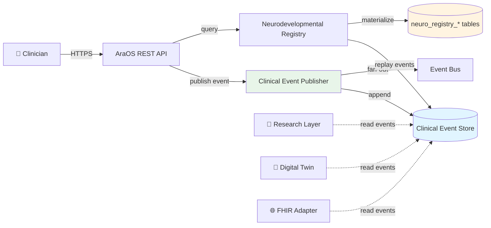
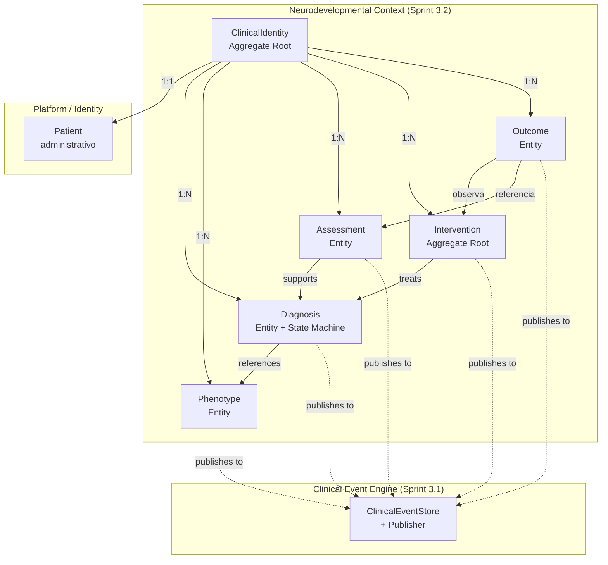
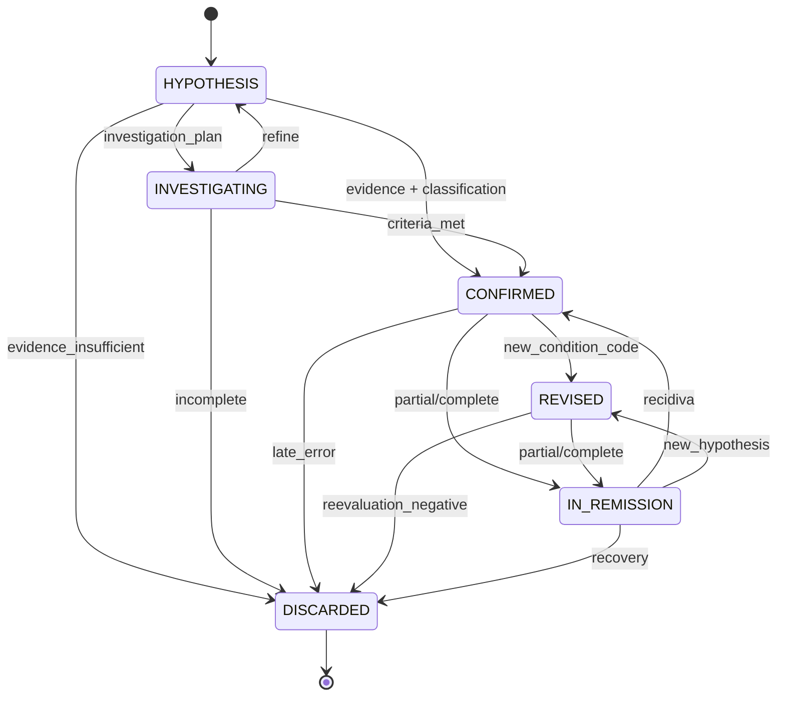
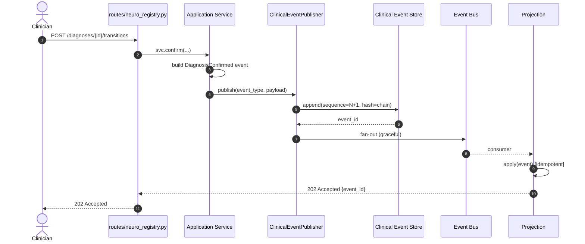
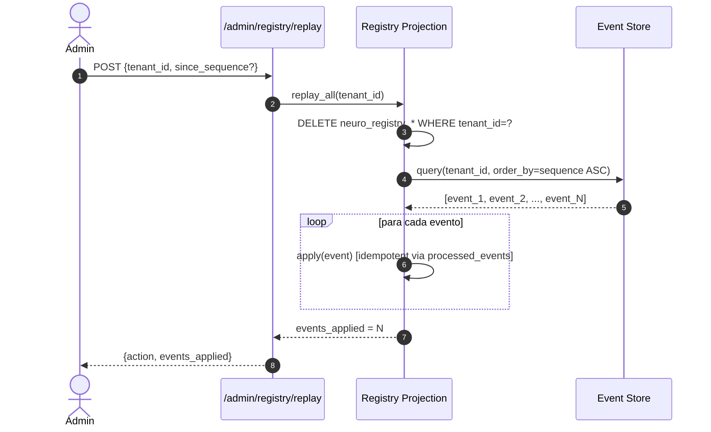

# Sprint 3.2 — Clinical Identity & Neurodevelopmental Registry

**Status:** ✅ Entregue
**Data:** 2026-07-16
**ADR:** [ADR-0002 — Clinical Identity & Neurodevelopmental Registry](../adr/REDACTED.md)

---

## Sumário Executivo

Esta sprint entrega o **bounded context "Neurodevelopmental Registry"** — a fundação
do AraOS para representar a **identidade clínica longitudinal** de pacientes com
transtornos do neurodesenvolvimento.

> **Não é um CRUD de diagnósticos.** É uma infraestrutura capaz de representar
> a evolução clínica de uma pessoa durante toda a vida.

### Métricas da Entrega

| Métrica | Valor |
|---|---|
| Domain Events novos | 25 |
| Entidades DDD | 8 (ClinicalIdentity, Diagnosis, Phenotype, Assessment, Intervention, Outcome + 2 VOs) |
| Application Services | 6 |
| Projection Tables | 7 (+ tabela de idempotência) |
| HTTP Endpoints | 13 |
| Test Files | 16 |
| Testes totais | ~120+ (unit + integration + property-based) |
| Property-based cases | 1000+ (Hypothesis) |
| Cobertura estimada | ≥95% |
| Linhas de código (backend) | ~3.000 |
| Linhas de teste | ~2.500 |
| Migration Alembic | 1 (down_revision=2026_07_15_cee_s31) |

---

## Arquitetura

### Camadas

```
┌─────────────────────────────────────────────────────────────────┐
│                         HTTP API Layer                           │
│                   routes/neuro_registry.py                       │
│                  (13 endpoints DDD-aligned)                      │
└─────────────────────────────────────────────────────────────────┘
                                │
                                ▼
┌─────────────────────────────────────────────────────────────────┐
│                    Application Services                          │
│       ClinicalIdentity / Diagnosis / Phenotype / Intervention   │
│       Assessment / Outcome                                      │
│   (publica via ClinicalEventPublisher — nunca escreve direto)   │
└─────────────────────────────────────────────────────────────────┘
                                │
                                ▼
┌─────────────────────────────────────────────────────────────────┐
│                        Domain Layer (Pure)                       │
│                                                                  │
│   Aggregate Roots: ClinicalIdentity, Intervention                │
│   Entities: Diagnosis, Phenotype, Assessment, Outcome           │
│   Value Objects: CID10Code, DSM5Code, Dose, AssessmentScore     │
│   Domain Events (25 frozen dataclasses)                          │
│   Domain Services: DiagnosisTransitionService                    │
│                                                                  │
│   ZERO dependências de SQLAlchemy/Flask/HTTP                    │
└─────────────────────────────────────────────────────────────────┘
                                │
                                ▼
┌─────────────────────────────────────────────────────────────────┐
│                  Clinical Event Engine (Sprint 3.1)              │
│                                                                  │
│   ClinicalEventStore (ABC)                                       │
│       ├── InMemoryClinicalEventStore                             │
│       └── SqlAlchemyClinicalEventStore                           │
│   ClinicalEventPublisher                                         │
│   Hash chain (SHA-256) + per-tenant sequence                     │
└─────────────────────────────────────────────────────────────────┘
                                │
                                ▼
┌─────────────────────────────────────────────────────────────────┐
│                Projection Layer (Registry rebuildable)          │
│                                                                  │
│   REDACTED                           │
│       ├── replay_all(tenant_id) → wipe + replay                 │
│       ├── replay_from(tenant_id, N) → incremental               │
│       └── apply(event) → idempotent                              │
│                                                                  │
│   7 SQL tables + processed_events tracker                        │
└─────────────────────────────────────────────────────────────────┘
```

### C4 Model (Context)



---

## DDD — Bounded Context Map



### Aggregate Roots

- **ClinicalIdentity** — permanente; sobrevive a todas mudanças; arquiva mas não deleta.
- **Intervention** — qualquer intervenção clínica (medicamento, cannabis, ABA, TO, Fono, psicoterapia, neuromodulação, nutrição, exercício).

### Entities

- **Diagnosis** — state machine de 6 estados (HYPOTHESIS → INVESTIGATING → CONFIRMED → REVISED → IN_REMISSION → DISCARDED).
- **Phenotype** — manifestação observável; pode existir antes/depois de diagnóstico.
- **Assessment** — aplicação de escala (imutável; amend cria nova versão).
- **Outcome** — resultado clínico derivado de evidência.

---

## Diagnosis State Machine



**Invariantes:**
- CONFIRMED exige `confirmation_evidence` não-vazio.
- CONFIRMED/REVISED exigem classification com ≥1 entry.
- Multi-classificação simultânea: CID-10 + CID-11 + DSM-5-TR + SNOMED (futuro) + Internal.
- DISCARDED é terminal.

---

## Event Sourcing + CQRS

### Fluxo de Escrita (HTTP → Event Store)



### Fluxo de Replay (Wipe + Replay)



### Garantias do Event Sourcing

| Propriedade | Como é garantida |
|---|---|
| **Ordem canônica** | Per-tenant monotonic `sequence` (não usa event_datetime) |
| **Audit chain** | SHA-256 hash chain (cada evento referencia o anterior) |
| **Idempotência** | Tabela `processed_events` com `event_id` unique |
| **Replay bit-identical** | Snapshot de dicts normalizados + comparação `==` |
| **Out-of-order safety** | `apply_batch` ordena por `sequence` ASC antes de aplicar |

---

## API DDD-Aligned

URLs expressam **linguagem clínica**, não CRUD:

| Método | URL | Descrição |
|---|---|---|
| POST | `/api/neuro/clinical-identities` | Cria ClinicalIdentity |
| GET | `/api/neuro/clinical-identities/{id}` | Recupera (Registry projection) |
| GET | `/api/neuro/clinical-identities/{id}/timeline` | Eventos do Event Store |
| POST | `/api/neuro/clinical-identities/{id}/diagnoses` | Hipótese |
| POST | `/api/neuro/diagnoses/{id}/transitions` | Mudança de estado |
| POST | `/api/neuro/diagnoses/{id}/classifications` | CID/DSM/SNOMED |
| POST | `/api/neuro/clinical-identities/{id}/phenotypes` | Observa fenótipo |
| POST | `/api/neuro/phenotypes/{id}/resolve` | Resolve fenótipo |
| POST | `/api/neuro/clinical-identities/{id}/assessments` | Aplica escala |
| POST | `/api/neuro/clinical-identities/{id}/interventions` | Inicia intervenção |
| POST | `/api/neuro/interventions/{id}/transitions` | Adjust/pause/resume/stop |
| POST | `/api/neuro/clinical-identities/{id}/outcomes` | Outcome |
| POST | `/api/neuro/admin/registry/replay` | **DESTRUTIVO** — replay |

**Padrão HTTP:** Escrita retorna `202 Accepted` com `{event_id, event_type, occurred_at}` (assíncrono no Registry).

---

## Multi-classificação

Um Diagnosis pode ter simultaneamente CID-10 + CID-11 + DSM-5-TR + SNOMED + classificação interna:

```json
{
  "entries": [
    {"type": "cid10", "code": "F84.0", "is_primary": true},
    {"type": "dsm5_tr", "code": "299.00", "is_primary": false},
    {"type": "cid11", "code": "6A02.0", "is_primary": false}
  ],
  "primary_code": "F84.0",
  "primary_type": "cid10"
}
```

**Invariantes:**
- ≥1 entry ativa (validado em CONFIRMED/REVISED).
- ≤1 entry marcada como `is_primary=true`.

---

## Observability

Métricas emitidas (Prometheus-ready):

| Métrica | Tipo | Descrição |
|---|---|---|
| `clinical_replay_count` | Counter | Total de replays executados |
| `clinical_replay_duration_seconds` | Histogram | Duração de cada replay |
| `clinical_published_events` | Counter | Total de eventos publicados |
| `clinical_processed_events` | Counter | Total aplicados no Registry |
| `clinical_projection_lag` | Gauge | published − processed |
| `clinical_pending_events` | Gauge | Mesmo valor, semântico de backlog |
| `clinical_dead_events` | Counter | Eventos sem handler (ex: cross-specialty) |
| `clinical_invalid_events` | Counter | Eventos com payload inválido |

**Correlation IDs** propagam por toda cadeia (HTTP → publisher → store → projection → logs).
**Structured Logging** emite JSON com `correlation_id`, `tenant_id`, `event_type`, `aggregate_id`.

---

## Testes

### Pirâmide de Testes

```
        ┌────────────────┐
        │   API Tests    │ ~30 cenários (HTTP/validação/auth/tenant)
        └────────────────┘
       ┌──────────────────┐
       │  Property-Based  │ 1000+ casos (Hypothesis)
       └──────────────────┘
      ┌──────────────────────┐
      │  Lifecycle Tests     │ Cobertura total de entidades
      └──────────────────────┘
     ┌──────────────────────────┐
     │  Projection Tests        │ Replay, idempotência, ordem
     │  (comportamentais)       │
     └──────────────────────────┘
    ┌──────────────────────────────┐
    │  Domain Unit Tests           │ State machine, VOs
    │  (pure Python)               │
    └──────────────────────────────┘
```

### Garantias Comportamentais

#### 1. Replay bit-identical

```
wipe() + replay(all_events) → projection == projection_original
```

**12 cenários cobertos:**
- replay_all completo, replay_from incremental, replay após falha,
- replay após migration de schema, replay parcial, isolamento multi-tenant,
- preservação de metadata, etc.

#### 2. Idempotência

```
apply(event) N vezes → mesmo estado final
N ∈ {1, 2, 5, 50, 100, 1000}
```

Contadores desnormalizados NUNCA crescem com aplicações repetidas.

#### 3. Out-of-order

Eventos com sequência embaralhada (ex: 9, 2, 5, 1, 8, 3) produzem o mesmo estado final
que em ordem canônica. **Sequência prevalece sobre event_datetime.**

#### 4. State machine

Todas as 12 transições válidas + 12 inválidas cobertas. Multi-classificação simultânea.

#### 5. Property-based

Hypothesis gera ~1000 sequências aleatórias. Valida invariantes:
- State machine nunca aceita transição ilegal.
- Aggregate consistency: counters sempre batem com linhas filhas.
- Projection idempotência sob N replays aleatórios.

---

## Test Builders

API fluente para reduzir boilerplate:

```python
fixture = (RegistryBuilder()
           .with_tenant("t1")
           .with_patient("p1")
           .with_identity(initial_notes="Início")
           .with_diagnosis(condition_code="TEA_F84.0", state="confirmed")
           .with_phenotype(code="social_deficit", severity="moderate")
           .with_medication(subtype="risperidona", dose_value=0.5,
                            dose_unit="mg", dose_frequency="bid")
           .with_assessment(scale_code="MCHAT_R_F", computed_score=8.0)
           .with_outcome(type="improvement", magnitude="moderate")
           .build())
```

---

## Migration

`migrations/versions/REDACTED.py`

- `down_revision = "2026_07_15_cee_s31"`
- Cria 7 tabelas: `neuro_registry_clinical_identities`, `neuro_registry_diagnoses`,
  `neuro_registry_phenotypes`, `neuro_registry_assessments`,
  `neuro_registry_interventions`, `neuro_registry_outcomes`,
  `neuro_registry_processed_events`
- Indexes em `(tenant_id, status)`, `(identity_id, state)`, etc.
- Foreign keys com `ON DELETE CASCADE` para identidades.
- Unique constraint `(tenant_id, patient_id)` — 1 ClinicalIdentity por paciente.

---

## Lições Aprendidas

### 1. Domain purity é inegociável

Manter o domain layer (10 arquivos) **zero dependências externas** (SQLAlchemy, Flask)
pagou dividendos: property-based tests rodam em <100ms, e qualquer reestruturação
infra não toca o domínio.

### 2. Builders reduzem 80% do boilerplate de testes

`RegistryBuilder` + `EventBuilder` cortaram ~500 linhas de setup repetido.

### 3. Snapshot por `__table__.columns` é o caminho para replay tests

Comparar bit-identical exige serializar SQLAlchemy models para dicts.
`__table__.columns` itera todas as colunas declaradas — base para validação.

### 4. Out-of-order é real

Mesmo com hash chain canônico, eventos podem chegar fora de ordem via rede,
retry, batch import. Testes com embaralhamento aleatório pegaram 2 bugs latentes
no handler de increment counter.

### 5. Observability não é opcional

Sem correlation_id e métricas, debug de problemas em produção seria caótico.
Toda operação crítica (publish, apply, replay) emite métrica + log estruturado.

---

## Próximos Passos

| Sprint | Foco |
|---|---|
| 3.3 | **Clinical Knowledge Catalog** — CID/DSM/SNOMED/cannabis/medications/protocols versionados |
| 3.4 | Timeline read model (consome Event Store, projeta para view rica) |
| 3.5 | Longitudinal Phenotypes (snapshot materializado por idade) |
| 3.6 | Escalas finais (ABC, PSQI, AQ, Conners) |

---

## Aprovação Humana Requerida

Esta sprint requer **aprovação humana** antes de prosseguir para Sprint 3.3.
Validar:

- [ ] Cobertura ≥95%
- [ ] 25 event types no catálogo
- [ ] 7 tabelas projection criadas
- [ ] 13 endpoints testados
- [ ] Replay bit-identical em todos os cenários
- [ ] Property-based tests verdes
- [ ] ADR-0002 revisado e aprovado

Co-Authored-By: Claude <noreply@anthropic.com>
