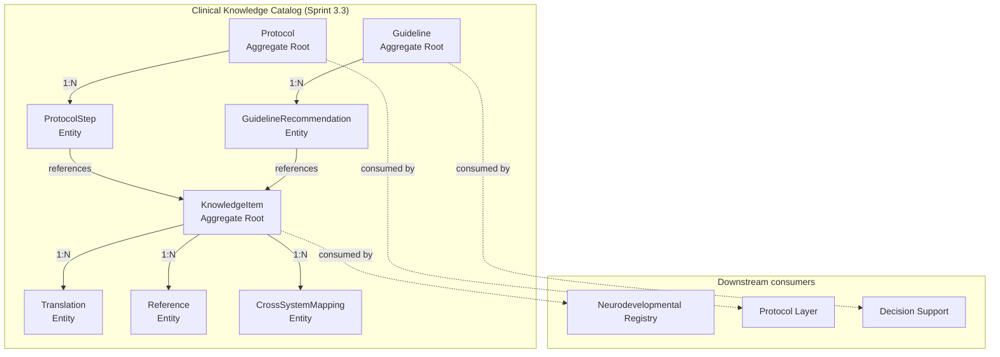
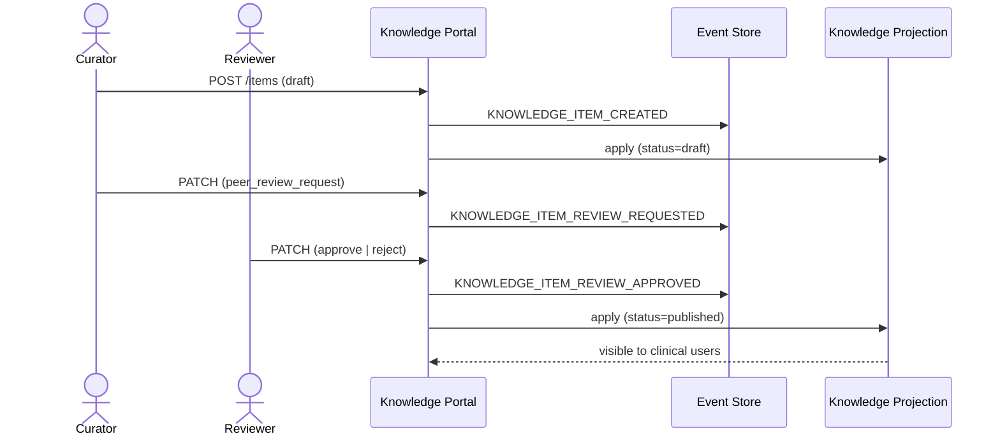

# Sprint 3.3 — Clinical Knowledge Catalog (Design Only)

**Status:** 📐 Design (NÃO implementar)
**Substitui:** "Conditions Catalog" original
**Data proposta:** Após aprovação Sprint 3.2

---

## Por que renomear

"Conditions Catalog" era limitado. A realidade do AraOS precisa de um **catálogo
clínico unificado** que cubra não apenas diagnósticos, mas **todo o conhecimento
estruturado** usado no domínio clínico:

- Diagnósticos (CID, DSM, SNOMED, internos)
- Fenótipos e manifestações
- Escalas e instrumentos de avaliação
- Medicamentos e canabinoides
- Intervenções terapêuticas
- Protocolos clínicos
- Guidelines e níveis de evidência
- Questionários
- Referências científicas

A renomeação para **Clinical Knowledge Catalog** reflete essa abrangência.

---

## Visão

> **"Single source of truth para todo conhecimento clínico estruturado,
> versionado, com provenience científica e internacionalização."**

### Princípios

1. **Versionamento imutável** — todo item é `(code, version)` único; mudanças criam nova versão.
2. **Provenance obrigatória** — cada item carrega fonte (PMID, guideline, study, expert panel).
3. **i18n first-class** — `pt-BR`, `en-US`, `es-ES` nativos desde o dia 1.
4. **Cross-system mapping** — CID-10 ↔ CID-11 ↔ DSM-5-TR ↔ SNOMED CT ↔ internal.
5. **Evidence levels** — gradiente explícito (A/B/C/expert-opinion).
6. **FHIR-ready** — estruturas compatíveis com `CodeSystem`/`Concept`/`ValueSet`.
7. **Read-only por padrão** — curation via PR/peer-review, não write direto de prod.

---

## Escopo

### Domínios cobertos

| Domínio | Sistemas | Exemplos |
|---|---|---|
| **Diagnósticos** | CID-10, CID-11, DSM-5, DSM-5-TR, SNOMED CT, internal | TEA F84.0, TDAH F90.0 |
| **Fenótipos** | HPO (Human Phenotype Ontology), internal | social_deficit, sensory_hypersensitivity |
| **Escalas** | ScaleRegistry existente (Sprints 1-2) + novas | MCHAT-R/F, CARS2, ATEC |
| **Medicamentos** | ANVISA, FDA, internal | risperidona, metilfenidato |
| **Canabinoides** | ANVISA RDC 327/2019, internal | CBD, THC, ratio CBD:THC |
| **Intervenções** | internal | ABA, TO, fonoaudiologia |
| **Questionários** | SDQ, CBCL, etc. | Questionário geral de comportamento |
| **Protocolos** | internal | Protocolo TEA infantil, TDAH adulto |
| **Guidelines** | NICE, AAP, SBP, internal | Practice parameter 2020 |
| **LOINC** | universal | exames laboratoriais |
| **ICF** | WHO | funcionalidade (b, s, d, e) |
| **Níveis de evidência** | GRADE, OCEBM | A (RCT meta), B (RCT), C (coorte) |
| **Referências científicas** | PubMed, DOI | PMID:12345678 |

### Estrutura unificada

```python
@dataclass(frozen=True)
class KnowledgeItem:
    """
    Unidade atômica do catálogo. Imutável.
    Toda mudança cria nova versão.
    """
    domain: KnowledgeDomain          # DIAGNOSIS | PHENOTYPE | MEDICATION | ...
    code: str                         # 'TEA_F84.0'
    version: str                      # '1.0.0' (semver)
    display_name: str                 # PT-BR canônico
    display_name_i18n: Dict[str, str] # {"pt-BR": "...", "en-US": "...", "es-ES": "..."}
    description: str
    description_i18n: Dict[str, str]
    category: str                     # 'neurodevelopmental' | 'psychiatric' | ...
    subcategory: Optional[str]
    evidence_level: EvidenceLevel     # A | B | C | EXPERT_OPINION
    references: List[Reference]       # PMIDs, DOIs, guideline citations
    cross_systems: Dict[str, str]     # {"CID10": "F84.0", "DSM5_TR": "299.00", "SNOMED": "..."}
    metadata: Dict[str, Any]          # extensível por domínio
    deprecated: bool = False
    replaced_by: Optional[str] = None # code da nova versão
    created_at: datetime
    created_by: str                   # curator user_id
    reviewed_by: List[str]            # peer reviewers
    approved_at: Optional[datetime]
```

---

## Agregados e bounded contexts



---

## Modelo de Versionamento

**Semver-like:** `MAJOR.MINOR.PATCH`

- `MAJOR`: mudança de semântica (ex: novos critérios diagnósticos).
- `MINOR`: adição de novo campo / subcategoria.
- `PATCH`: correção de typo, ref de referência atualizada.

**Migration path:**
- `v1.0.0` → `v1.1.0`: backward-compatible (apenas adições).
- `v1.1.0` → `v2.0.0`: breaking change. Item antigo marcado `deprecated=true`, `replaced_by=v2.0.0`.

---

## Eventos do Knowledge Catalog

Novos event types no catálogo (estimativa: ~15):

```
KNOWLEDGE_ITEM_CREATED
KNOWLEDGE_ITEM_VERSIONED
KNOWLEDGE_ITEM_DEPRECATED
KNOWLEDGE_ITEM_MAPPING_ADDED
KNOWLEDGE_ITEM_TRANSLATION_ADDED
KNOWLEDGE_ITEM_REVIEW_APPROVED
KNOWLEDGE_ITEM_REVIEW_REJECTED
PROTOCOL_CREATED
PROTOCOL_VERSIONED
PROTOCOL_STEP_ADDED
GUIDELINE_PUBLISHED
GUIDELINE_RECOMMENDATION_ADDED
```

Esses eventos alimentam projeções específicas:
- `KnowledgeItemLatestProjection` (read model otimizado).
- `ProtocolTimelineProjection` (timeline de versões).
- `GuidelineIndexProjection` (busca por especialidade/condição).

---

## API (design — não implementar)

```
GET    /api/knowledge/items                              → busca
GET    /api/knowledge/items/{domain}/{code}              → latest version
GET    /api/knowledge/items/{domain}/{code}/versions     → histórico
GET    /api/knowledge/items/{domain}/{code}/v/{version}  → versão específica
GET    /api/knowledge/translations/{locale}              → todas traduções para locale
GET    /api/knowledge/mappings/{from_system}/{code}      → cross-system lookups
POST   /api/knowledge/items                              → curator only (peer-review)
PATCH  /api/knowledge/items/{id}/approve                 → reviewer only
GET    /api/knowledge/protocols/{code}/timeline          → versões + steps
GET    /api/knowledge/guidelines/{specialty}/recommendations
```

---

## Storage

### PostgreSQL (primary)

Tabela principal `knowledge_items` com partitioning por `domain`:

```sql
CREATE TABLE knowledge_items (
    id UUID PRIMARY KEY,
    domain VARCHAR(32) NOT NULL,
    code VARCHAR(64) NOT NULL,
    version VARCHAR(16) NOT NULL,
    display_name TEXT NOT NULL,
    display_name_i18n JSONB NOT NULL,
    description TEXT,
    description_i18n JSONB,
    category VARCHAR(64),
    subcategory VARCHAR(64),
    evidence_level VARCHAR(16),
    cross_systems JSONB NOT NULL DEFAULT '{}',
    metadata JSONB NOT NULL DEFAULT '{}',
    deprecated BOOLEAN NOT NULL DEFAULT FALSE,
    replaced_by VARCHAR(80),  -- domain/code/version
    created_at TIMESTAMPTZ NOT NULL,
    created_by VARCHAR(64) NOT NULL,
    reviewed_by JSONB NOT NULL DEFAULT '[]',
    approved_at TIMESTAMPTZ,
    UNIQUE (domain, code, version)
);

CREATE INDEX idx_ki_domain_category ON knowledge_items(domain, category);
CREATE INDEX idx_ki_evidence ON knowledge_items(evidence_level);
CREATE INDEX idx_ki_deprecated ON knowledge_items(deprecated) WHERE deprecated = false;
CREATE INDEX idx_ki_cross_systems ON knowledge_items USING GIN (cross_systems);
CREATE INDEX idx_ki_i18n ON knowledge_items USING GIN (display_name_i18n);
```

### FHIR CodeSystem export

Geração batch de `CodeSystem-{domain}.json` para interoperabilidade.
Exemplo: `CodeSystem-cid10.json` com ~14.400 conceitos.

---

## Curator Workflow



---

## Critérios de Aceitação (Design)

- [ ] Domínios e sistemas mapeados (12 domínios, 8 sistemas de classificação).
- [ ] Modelo `KnowledgeItem` desenhado (imutável, versionado, i18n, evidence).
- [ ] Agregados `Protocol` e `Guideline` modelados.
- [ ] Cross-system mapping strategy definida.
- [ ] Event types novos definidos (~15).
- [ ] Storage schema PostgreSQL com partitioning.
- [ ] API endpoints desenhados (read + curator).
- [ ] Curator workflow especificado (draft → peer-review → published).
- [ ] FHIR export planejado.
- [ ] Plano de seed data (fontes: WHO ICD-10/11, APA DSM-5-TR, NICE guidelines).

---

## Riscos

| Risco | Mitigação |
|---|---|
| Escopo muito amplo (12 domínios) | Slicing por sprint: 3.3a (Diagnósticos+Medicamentos+Canabinoides), 3.3b (Protocolos+Guidelines), 3.3c (Escalas+Questionários) |
| Licenciamento dos dados | CID/DSM: WHO/APA licensing; SNOMED: UHID membership; HPO: open-source |
| i18n retroativo | Definir schemas de tradução antes de seedar dados |
| Curator bottleneck | Peer-review distribuído (mínimo 2 revisores), automatizar checks |
| Drift entre catálogos (CID-10 vs CID-11) | Cross-system mapping com versionamento explícito |

---

## Estimativa

- **Backend:** ~4.000 LOC (catalog + protocol + guideline + projections + seed)
- **Frontend (Knowledge Portal):** ~3.000 LOC (curator UI)
- **Seed data:** ~5.000 items (curados manualmente por especialidade)
- **Fases:** 3-4 sub-sprints (3.3a/b/c/d)
- **Dependência externa:** Licenças CID/DSM (WHO + APA)

---

## Próximos passos após Design aprovado

1. **ADR-0004** — Clinical Knowledge Catalog (formal)
2. Sub-sprint 3.3a — Diagnósticos + Medicamentos + Canabinoides
3. Curadoria inicial (~500 items) antes de expor API pública
4. Integração com Neurodevelopmental Registry (FKs)
5. Knowledge Portal (frontend curator)

---

**NÃO IMPLEMENTAR até aprovação humana e finalização do seed data sourcing.**
