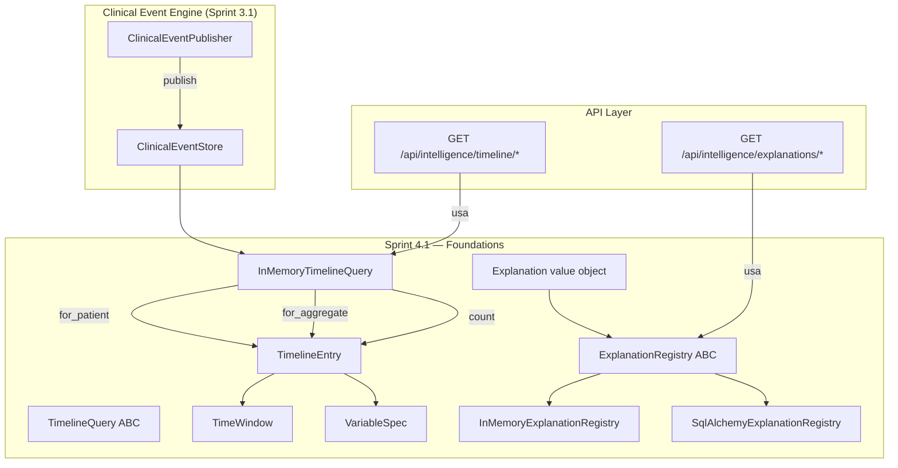
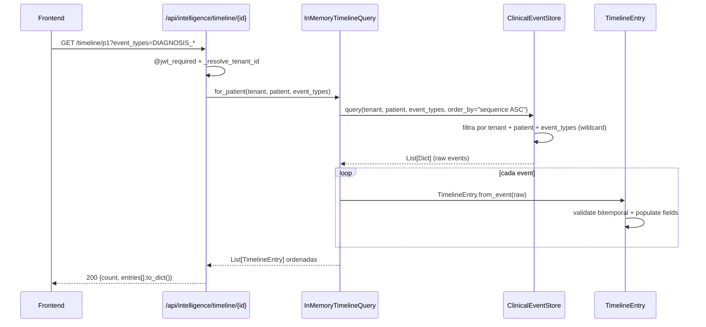
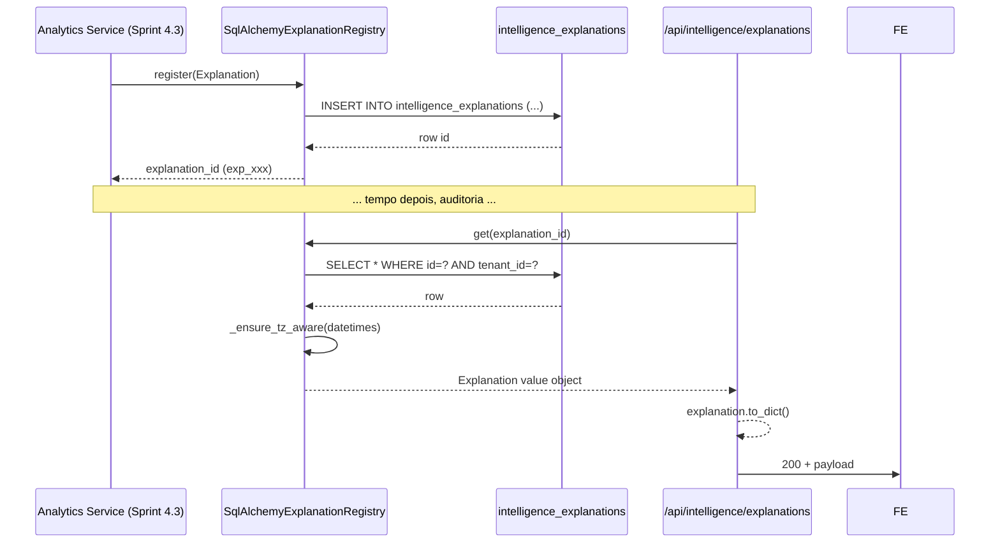

# Sprint 4.1 — Foundations (Timeline + Explainability)

> **Entrega:** 2026-07-17
> **Sub-sprint de:** [Sprint 4 — Clinical Intelligence Platform](./vivid-snuggling-moth.md)
> **Próximo:** Sprint 4.2 — Clinical Episode Engine (aguardando aprovação)

---

## Context

AraOS, após Sprint 3.1 (Clinical Event Engine) + Sprint 3.2 (Neurodevelopmental Registry),
captura 25+ eventos clínicos com audit chain canônico e hash chain SHA-256.
**O que faltava**: transformar esse stream em inteligência clínica explicável.

Sprint 4.1 entrega a **foundation** sobre a qual todos os outros sub-sprints
serão construídos:

1. **Clinical Timeline Engine** — leitura ordenada e bitemporal da história clínica.
2. **Explainability Core** — contrato cross-cutting: toda análise DEVE emitir uma `Explanation`.

Sem essas duas bases, Correlation, Analytics, Outcome, Cohort, Research e Dashboard
não podem existir.

---

## Decisões Arquiteturais

### Bitemporal Modeling

Cada `TimelineEntry` carrega duas datas:

| Campo | Significado | Exemplo |
|---|---|---|
| `event_datetime` (valid_time) | Quando o evento **clínico** aconteceu | Data da crise do paciente |
| `recorded_at` (transaction_time) | Quando foi **publicado** no Event Store | Data em que o médico registrou tardiamente |

Essa separação é fundamental para auditoria regulatória (LGPD/SOC2/HIPAA),
late-arriving events e time travel queries.

### Explainability Contract

Toda análise clínica (correlação, trend, anomaly, hypothesis) **emite uma `Explanation`**:

```python
@dataclass(frozen=True)
class Explanation:
    explanation_id: str        # exp_<uuid16>
    analysis_id: str           # qual análise produziu
    analysis_type: str         # "correlation" | "trend" | ...
    question: str              # "CBD melhora sono?"
    answer: str                # "Correlação moderada (r=0.45)"
    confidence: float          # [0.0, 1.0]
    method: str                # "pearson", "spearman", "linear_regression"
    data_window: TimeWindow    # período analisado
    variables: List[VariableSpec]
    contributing_event_ids: List[str]  # 5–20 representativos
    assumptions: List[str]
    limitations: List[str]     # SEMPRE ≥ 1 — toda análise tem limitações
    created_at: datetime
    analyst: str               # "system" | user_id
```

**Invariantes enforced em `__post_init__`:**
- `confidence ∈ [0.0, 1.0]`
- `variables ≥ 1` (toda análise opera sobre ≥1 variável)
- `limitations ≥ 1` (mandatory — "toda análise tem limitações")
- `contributing_event_ids` vazio apenas se `limitations` explica data scarcity

---

## Mapa do Bounded Context (Sprint 4.1)



---

## Sequence — Timeline Query



---

## Sequence — Explanation Registry (Write + Read)



---

## Estrutura de Arquivos

```
araos/
├── clinical/
│   ├── timeline/
│   │   ├── __init__.py               # exports + backward compat shim
│   │   ├── application/
│   │   │   ├── __init__.py
│   │   │   └── query.py              # TimelineQuery ABC + InMemoryTimelineQuery
│   │   └── domain/
│   │       ├── __init__.py
│   │       ├── entries.py            # TimelineEntry (bitemporal)
│   │       ├── window.py             # TimeWindow
│   │       └── variable.py           # VariableSpec + VariableSource
│   └── explainability/
│       ├── __init__.py               # exports + ImportError fallback for SQL
│       ├── domain/
│       │   ├── __init__.py
│       │   └── explanation.py        # Explanation + AnalysisType
│       ├── registry.py               # ExplanationRegistry ABC + InMemory
│       └── sql.py                    # SqlAlchemyExplanationRegistry + models

routes/
├── _helpers.py                        # _resolve_tenant_id, _get_actor_id, ...
├── intelligence_timeline.py           # blueprint `intelligence_timeline`
└── explainability.py                  # blueprint `explainability`

migrations/versions/
└── REDACTED.py
```

---

## API Endpoints

### `intelligence_timeline` (prefix `/api/intelligence`)

| Método | Path | Descrição |
|---|---|---|
| GET | `/timeline/{patient_id}` | Timeline completa do paciente (ordenada por sequence ASC) |
| GET | `/timeline/{patient_id}/range?since=&until=` | Janela temporal explícita |
| GET | `/aggregates/{aggregate_type}/{aggregate_id}/timeline` | Histórico de um aggregate (diagnosis, intervention, etc.) |
| GET | `/timeline/{patient_id}/count` | Contagem (dashboards) |

**Query params comuns**: `?event_types=DIAGNOSIS_*` (wildcard suportado),
`?episode_id=ep-1` (Sprint 4.2), `?limit=N` (cap defensivo 5000).

### `explainability` (prefix `/api/intelligence`)

| Método | Path | Descrição |
|---|---|---|
| GET | `/explanations/{id}` | Recupera 1 Explanation |
| GET | `/explanations?analysis_id=...` | Lista explicações por análise |
| GET | `/explanations?event_id=...` | Lista explicações por evento |
| GET | `/explanations?analysis_type=...` | Lista explicações por tipo |
| GET | `/explanations/{id}/verify` | Verifica invariantes (200 valid / 422 invalid) |

---

## Permissões Adicionadas (19)

```python
# araos/platform/identity/permissions.py
INTELLIGENCE_TIMELINE_READ = "intelligence.timeline.read"
INTELLIGENCE_EPISODE_READ = "intelligence.episode.read"
INTELLIGENCE_EPISODE_WRITE = "intelligence.episode.write"
INTELLIGENCE_EPISODE_CONFIRM = "intelligence.episode.confirm"
INTELLIGENCE_ANALYTICS_READ = "intelligence.analytics.read"
INTELLIGENCE_CORRELATION_READ = "intelligence.correlation.read"
INTELLIGENCE_CORRELATION_COMPUTE = "intelligence.correlation.compute"
INTELLIGENCE_COHORT_READ = "intelligence.cohort.read"
INTELLIGENCE_COHORT_DEFINE = "intelligence.cohort.define"
RESEARCH_EXPORT = "research.export"
RESEARCH_OMOP_ACCESS = "research.omop.access"
EXPLAINABILITY_READ = "explainability.read"
EXPLAINABILITY_AUDIT = "explainability.audit"
DASHBOARD_PATIENT_VIEW = "dashboard.patient.view"
DASHBOARD_COHORT_VIEW = "dashboard.cohort.view"
DASHBOARD_MANAGERIAL = "dashboard.managerial"
ML_FEATURE_READ = "ml.feature.read"
ML_DATASET_BUILD = "ml.dataset.build"
ML_PREDICT_USE = "ml.predict.use"
```

---

## Catálogo de Eventos — Adições (2)

| Event Type | Producer | Description |
|---|---|---|
| `EXPLANATION_REGISTERED` | `intelligence` | Uma Explanation foi registrada no Registry |
| `EXPLANATION_INVALID` | `intelligence` | DLQ — análise tentou registrar Explanation inválida |

Producer **novo**: `EventProducer.INTELLIGENCE = "intelligence"` (acrescenta
ao enum em `event_store/catalog.py`).

---

## Database Migration

```python
# migrations/versions/REDACTED.py
revision = "REDACTED"
down_revision = "2026_07_16_neuro_registry_s32"

# Tabela: intelligence_explanations
#   - id, tenant_id, analysis_id, analysis_type
#   - question, answer, confidence, method
#   - data_window_start, data_window_end, data_window_label
#   - variables_json, contributing_event_ids_json
#   - assumptions_json, limitations_json
#   - analyst, correlation_id, metadata_json
#   - created_at, updated_at
#
# Tabela: REDACTED
#   - idempotency tracker com UniqueConstraint(event_id, processor)
#
# 5 indexes:
#   - REDACTED
#   - REDACTED
#   - ix_intel_explanations_tenant_type
#   - ix_intel_explanations_correlation
#   - ix_intel_proc_qevents_event
```

---

## Métricas de Entrega

| Métrica | Valor | Gate DoD |
|---|---|---|
| Testes totais | 117 | — |
| Testes passing | 117 (100%) | ✅ |
| Cobertura timeline/domain | 95-100% | ≥95% ✅ |
| Cobertura explainability/domain | 100% | ≥95% ✅ |
| Cobertura explainability/registry | 100% | ≥95% ✅ |
| Cobertura explainability/sql | 96% | ≥95% ✅ |
| **Cobertura geral Sprint 4.1** | **96%** | ≥95% ✅ |
| Endpoints REST | 7 | — |
| Permissões adicionadas | 19 | — |
| Event types adicionados | 2 | — |
| Migrações Alembic | 1 | — |

---

## Bugs Encontrados e Corrigidos

1. **JWT dict identity rejected** — flask-jwt-extended ≥4.7.4 só aceita identity string.
   Incompatibilidade com `auth.py` do projeto que usa dict. Mitigação em testes:
   `identity="user_id", additional_claims={"tenant_id": ...}` + header `X-Tenant-ID`.
2. **`InMemoryExplanationRegistry` ignorava tenant_id** — bug sério de tenant leak.
   `list_for_analysis`, `list_for_event`, `list_for_type`, `count` agora filtram
   por `e.tenant_id == tenant_id`.
3. **`InMemoryTimelineQuery.count()` ignorava event_types** — `?event_types=DIAGNOSIS_*`
   no `/count` não filtrava. Corrigido: delega a `store.query(event_types=...)` quando
   há filtro.
4. **SQLite devolve naive datetimes** — mesmo com `DateTime(timezone=True)`.
   Helper `_ensure_tz_aware()` em `sql.py:_row_to_explanation()`.
5. **URL encoding `+00:00` → space** — Flask `request.args` decodifica `+` como espaço.
   Workaround nos testes: usar `Z` suffix.

---

## Smoke Test

```bash
# 1. Aplicar migration
alembic upgrade head
# → cria tabelas: intelligence_explanations, REDACTED

# 2. Rodar suite
pytest tests/intel_sprint_4_1/ -v \
  --cov=araos.clinical.timeline.domain \
  --cov=araos.clinical.timeline.application \
  --cov=araos.clinical.explainability.domain \
  --cov=araos.clinical.explainability.registry \
  --cov=araos.clinical.explainability.sql \
  --cov-fail-under=95
# → 117 passed, coverage 96%

# 3. Smoke via API (curl)
TOKEN=$(...)

# a. Timeline do paciente
curl -H "Authorization: Bearer $TOKEN" -H "X-Tenant-ID: t1" \
  "http://localhost:5000/api/intelligence/timeline/p1?event_types=DIAGNOSIS_*"
# → 200 { count, entries[].to_dict() }

# b. Range query
curl -H "Authorization: Bearer $TOKEN" -H "X-Tenant-ID: t1" \
  "http://localhost:5000/api/intelligence/timeline/p1/range?since=2026-01-01T00:00:00Z&until=2026-12-31T00:00:00Z"

# c. Aggregate timeline
curl -H "Authorization: Bearer $TOKEN" -H "X-Tenant-ID: t1" \
  "http://localhost:5000/api/intelligence/aggregates/diagnosis/d-1/timeline"

# d. Explanation list
curl -H "Authorization: Bearer $TOKEN" -H "X-Tenant-ID: t1" \
  "http://localhost:5000/api/intelligence/explanations?analysis_id=ana-1"
# → 200 { count, explanations[] }

# e. Verify
curl -H "Authorization: Bearer $TOKEN" -H "X-Tenant-ID: t1" \
  "http://localhost:5000/api/intelligence/explanations/exp_abc/verify"
# → 200 { valid: true, violations: [] }  ou 422 se inválida

# 4. Audit chain intacta
psql -c "SELECT verify_chain('t1') FROM clinical_events"  # → true
```

---

## Próximos Sub-Sprints

### Sprint 4.2 — Clinical Episode Engine

- `araos/clinical/episode/` — ClinicalEpisode aggregate + EpisodeService + EpisodeProjection
- EpisodeSuggestionEngine (rule-based, sem ML)
- 5 endpoints: POST /episodes, POST /episodes/{id}/close, POST /episodes/{id}/events, GET /episodes/{id}, GET /patients/{id}/episodes
- 5 event types: CLINICAL_EPISODE_OPENED/CLOSED/EVENT_LINKED/CANDIDATE_SUGGESTED/CANDIDATE_CONFIRMED
- 3 permissões + 1 role (intelligence_curator)
- 1 migration (2026_07_18)

### Sprint 4.3 — Longitudinal Analytics + Outcome Engine

- `araos/clinical/analytics/` — TimeSeries + LinearRegressionAnalytics + MovingAverageAnalytics
- `araos/clinical/outcomes/` — OutcomeTrajectory + OutcomeService
- 4 event types + 1 migration

### Sprint 4.4 — Correlation + Cohort + Research Workspace

- `araos/clinical/correlation/` — Pearson/Spearman/Kendall/Cross/Lag/Window
- `araos/clinical/cohort/` — CohortBuilder + criteria evaluation
- `araos/research/` — CSV/Parquet/FHIR/OMOP exporters + anonymization policies
- 1 role (clinical_researcher) + 1 migration

### Sprint 4.5 — Dashboard Engine + ML Preparation

- `araos/clinical/dashboard/` — ChartSpec (10 chart types) + DashboardService
- `araos/ml/` — FeatureStore ABC + TrainingDatasetBuilder + InferenceDatasetBuilder + PredictionPipeline ABC + InMemoryFeatureStore
- `/api/ml/predict` retorna 501 Not Implemented (regra — ML só interfaces)

---

## Princípios Mantidos (do plano Sprint 4)

> **Não estamos construindo uma IA que pensa por médicos.**
> **Estamos construindo a infraestrutura que torna a IA auditável,
> explicável e sempre submissa ao julgamento clínico humano.**

- ✅ IA nunca diagnostica
- ✅ IA nunca substitui o médico
- ✅ Toda análise é explicável (Explanation obrigatória)
- ✅ Zero novos cadastros (reusa ClinicalIdentity + entidades Sprint 3.2)
- ✅ Zero frontend acoplado (API-first)
- ✅ DDD rigoroso + ABC + InMemory + SQL three-tier
- ✅ ML só como interfaces (Sprint 4.5)
