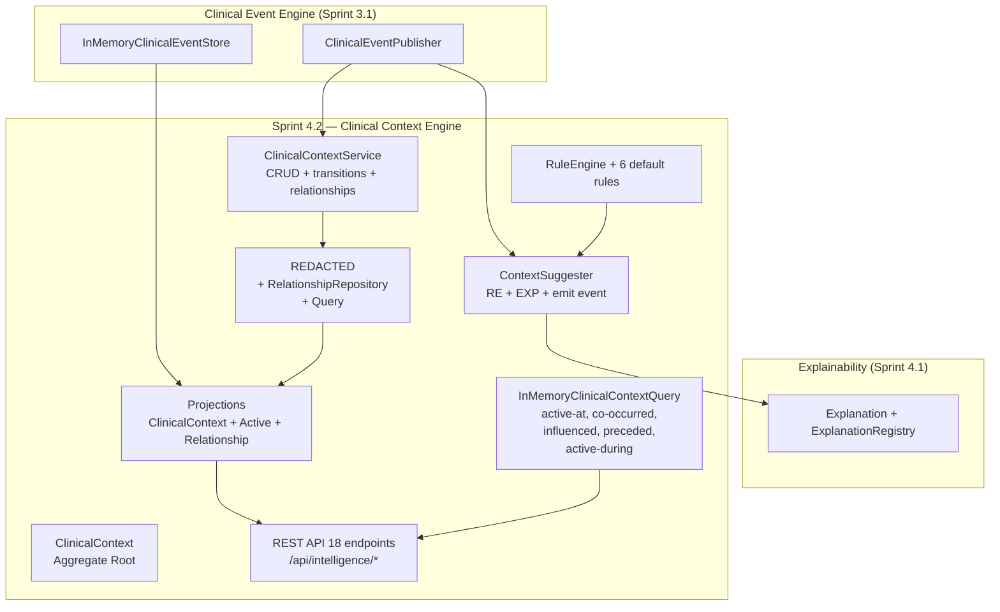
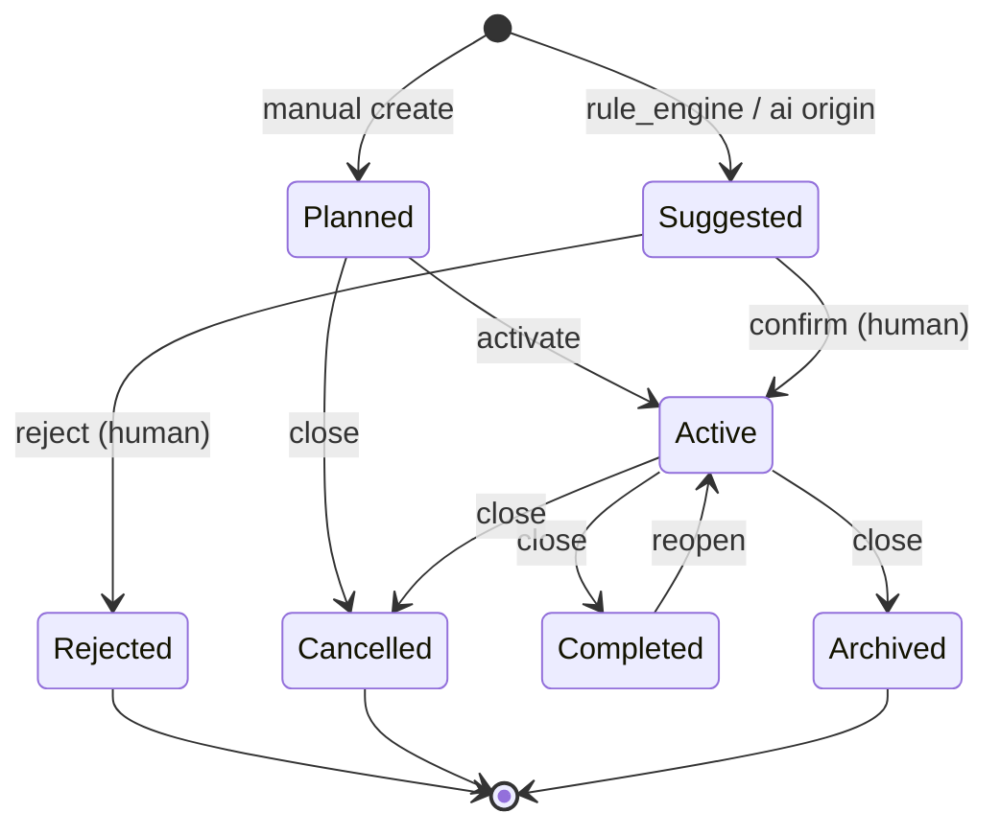

# Sprint 4.2 — Clinical Context Engine

**Status:** ✅ Entregue (2026-07-17)
**ADR-0003:** [REDACTED.md](./REDACTED.md)

---

## Resumo Executivo

Pivot da "Clinical Episode Engine" (escopo original do plano) para o **Clinical Context Engine** —
camada que representa **qualquer contexto clínico relevante** para a evolução longitudinal do
paciente, não apenas episódios discretos. Um contexto pode ser uma crise, mas também uma
medicação contínua, um padrão de sono, uma fase comportamental, uma transição escolar ou um
evento familiar.

**Princípios inegociáveis:**
- IA nunca diagnostica. Identifica padrões, correlações, tendências, hipóteses — sempre
  explicáveis.
- Nenhuma sugestão altera dados automaticamente. Toda sugestão exige **confirmação humana**.
- Explicabilidade obrigatória: cada sugestão emite `Explanation` registrada no registry.
- Multi-tenancy + audit chain canônico + hash chain mantidos.
- Reuso integral de Sprints 3.1 (Event Sourcing) e 4.1 (Explainability).

---

## Bounded Context



---

## Domain — Aggregate Root

`ClinicalContext` é o aggregate root. Tem 10 subtipos via enum `ContextType`:

| Tipo | Significado |
|---|---|
| `clinical_episode` | Episódio clínico discreto (crise, surto, intercorrência) |
| `medication_context` | Uso de medicação (início, troca, dose, adesão) |
| `school_context` | Contexto escolar (troca, ingresso, evasão) |
| `family_context` | Contexto familiar (nascimento, luto, separação) |
| `environmental_context` | Ambiente físico/social (mudança, exposição) |
| `developmental_milestone` | Marco desenvolvimental |
| `behavioral_phase` | Fase comportamental (período de estabilidade, instabilidade) |
| `sleep_pattern` | Padrão de sono (insônia, hipersonia, fragmentação) |
| `educational_transition` | Transição educacional |
| `social_context` | Contexto social (isolamento, grupo de pares) |

### Status State Machine

7 estados com transições explícitas:



### Origin

5 origens possíveis:
- `manual` — fato criado por humano (confidence = 1.0 obrigatório)
- `rule_engine` — disparado por regra (confidence < 1.0)
- `artificial_intelligence` — disparado por IA (confidence < 1.0)
- `import` — importado de fonte externa (CSV, FHIR)
- `research` — gerado em contexto de pesquisa

### Invariantes Críticas

- Manual origin → confidence_score == 1.0 (fato, não hipótese).
- Automated origin → confidence_score < 1.0 (hipótese).
- Status REJECTED → não pode ter `confirmed_by` (estado terminal).
- Status COMPLETED/CANCELLED/ARCHIVED → exige `end_date`.
- Reabertura só de COMPLETED → ACTIVE.
- Toda sugestão (origem automatizada) → exige confirmação humana.

---

## Architecture Patterns

### Event Sourcing (Sprint 3.1 reuse)

Cada operação sobre `ClinicalContext` emite um evento de domínio:

```
CLINICAL_CONTEXT_SUGGESTED      → marca idempotência do Rule Engine
CLINICAL_CONTEXT_CREATED        → criação via serviço
CLINICAL_CONTEXT_ACTIVATED      → transition to Active
CLINICAL_CONTEXT_UPDATED        → merge metadados
CLINICAL_CONTEXT_CLOSED         → transition to terminal (Completed/Cancelled/Archived)
CLINICAL_CONTEXT_REOPENED       → Completed → Active
CLINICAL_CONTEXT_LINKED         → grafo: cria edge
CLINICAL_CONTEXT_UNLINKED       → grafo: remove edge
CLINICAL_CONTEXT_REJECTED       → Suggested → Rejected
CLINICAL_CONTEXT_TYPE_CONFIRMED → override de tipo após confirmação
```

Cada evento carrega `payload` completo (status, type, origin, dates, observations,
source_event_ids, professionals, etc) garantindo reconstrução bit-identical.

### Projections (rebuildable + idempotent)

3 projections materializadas:

1. **ClinicalContextProjection** — write-side, mantém `clinical_contexts` agregada.
   Idempotência via tabela `processed_events` (Sprint 3.1).
2. **ActiveContextProjection** — read-side, mantém `clinical_contexts_active`
   apenas contexts com status PLANNED/SUGGESTED/ACTIVE.
3. **RelationshipProjection** — grafo BFS, neighbors depth-N, top_connected.

Replay bit-identical validado em `REDACTED`.

### Multi-tenancy + Audit Chain

- `tenant_id` em toda entidade, todo evento, todo endpoint.
- `correlation_id` propagado (Sprint 4.1).
- Audit chain via `created_by`, `updated_by`, `aggregate_version`.
- `processed_events` garante exactly-once por (tenant, sequence).

---

## Application Layer

### ClinicalContextService (puro, sem I/O)

```python
svc.create(CreateContextCommand) -> ClinicalContext
svc.activate(context, actor_id) -> ClinicalContext
svc.close(context, actor_id, new_status, end_date, summary) -> ClinicalContext
svc.reopen(context, actor_id, reason) -> ClinicalContext
svc.reject(context, actor_id, reason) -> ClinicalContext
svc.confirm_suggestion(context, actor_id, confirmed_type) -> ClinicalContext
svc.update(context, actor_id, changes) -> ClinicalContext
svc.link(tenant_id, source, target, rel_type, ..., patient_id) -> ContextRelationship
svc.unlink(relationship, actor_id, patient_id) -> None
```

### Rule Engine — 6 default rules

| Rule ID | Trigger | Context Type Sugerido |
|---|---|---|
| `med_introduction` | MEDICATION_STARTED | `medication_context` |
| `school_change` | SCHOOL_CHANGE_RECORDED | `school_context` / `educational_transition` |
| `family_change` | FAMILY_CHANGE_RECORDED | `family_context` |
| `behavioral_crisis_pattern` | OUTCOME_WORSENING após intervenção | `behavioral_phase` / `clinical_episode` |
| `sleep_disruption` | SLEEP_HOURS drop > 30% | `sleep_pattern` |
| `regression_window` | ASSESSMENT_APPLIED com regressão | `developmental_milestone` |

Cada `ContextSuggestion` carrega `contribution_events`, `limitations`, `confidence`.

### Query Engine

`InMemoryClinicalContextQuery` + `SqlAlchemyClinicalContextQuery`:
- `for_patient(tenant, patient, status, type)` — filtros
- `get(tenant, context_id)`
- `active_at(tenant, patient, at_date)` — temporal
- `co_occurred(tenant, patient, date_a, date_b)` — pares simultâneos
- `influenced_outcome(tenant, outcome_id)` — contextos que linkaram outcome
- `preceded_improvement(tenant, patient, window_days)` — retrospectivo
- `active_during(tenant, intervention_id)` — durante janela de intervenção

---

## Graph Model — Relationships

`ContextRelationship` é uma edge tipada:

```python
class RelationshipType(str, Enum):
    INFLUENCED = "influenced"
    RELATED_TO = "related_to"
    IMPACTED = "impacted"
    PRECEDED = "preceded"
    CAUSED = "caused"
    CO_OCCURRED = "co_occurred"
```

- Confiança da edge ∈ [0, 1].
- `evidence_event_ids` — proveniência dos eventos que originaram a edge.
- Self-loop permitido (contexto A → A).
- Multi-tenant strict (não vaza entre tenants).
- Grafo BFS até depth N.

---

## REST API (18 endpoints)

Blueprint: `/api/intelligence` (registrado em `app_cors_livre.py`).

| Method | Path | Função |
|---|---|---|
| POST | `/contexts` | Criar contexto (manual ou from-suggestion) |
| GET | `/contexts/{id}` | Recuperar |
| GET | `/patients/{id}/contexts` | Listar contextos do paciente |
| PATCH | `/contexts/{id}` | Atualizar metadados |
| DELETE | `/contexts/{id}` | Remover (soft delete) |
| POST | `/contexts/{id}/activate` | Planned → Active |
| POST | `/contexts/{id}/close` | → Completed/Cancelled/Archived |
| POST | `/contexts/{id}/reopen` | Completed → Active |
| POST | `/contexts/{id}/reject` | Suggested → Rejected |
| POST | `/contexts/{id}/confirm` | Suggested → Active + type override |
| POST | `/patients/{id}/contexts/suggest` | Rule Engine → Suggestions + Explanation |
| GET | `/patients/{id}/contexts/suggested` | Listar SUGGESTED para confirmação |
| POST | `/contexts/{id}/relationships` | Criar edge |
| GET | `/contexts/{id}/relationships` | Listar edges |
| DELETE | `/contexts/{id}/relationships/{rel_id}` | Remover edge |
| GET | `/contexts/{id}/neighbors?depth=N` | BFS neighbors |
| GET | `/patients/{id}/contexts/active-at?at=ISO` | Temporal query |
| GET | `/patients/{id}/contexts/co-occurred?date_a=&date_b=` | Co-occurrence |

**Auth:** `@jwt_required()` + `X-Tenant-ID` header (Sprint 4.1 padrão).
**Errors:** 401 (sem auth), 404 (tenant isolation), 400 (validação), 503 (sem DB).

---

## Migration Alembic

`migrations/versions/2026_07_18_clinical_context_s42.py` encadeada após
`REDACTED` com `downgrade_reference`.

Cria:
- `clinical_contexts` (12 colunas + 5 índices)
- `clinical_context_relationships` (tenant_id + source/target index)
- `REDACTED` (idempotência do Rule Engine)

---

## Testes

| Suite | Testes | Foco |
|---|---|---|
| `test_domain.py` | 71 | Value Objects, aggregate, state machine, Rule ABC |
| `test_application.py` | 52 | Service, Rule Engine, InMemoryQuery |
| `test_sql_and_projections.py` | 50 | SQL repos, projections (apply + rebuild + idempotency) |
| `test_api.py` | 25 | HTTP routes, JWT, tenant isolation |
| `test_coverage_boost.py` | 55 | Handlers, active_projection, relationship_projection |
| **Total** | **253** | **95% cobertura** |

**Coverage por módulo:**
```
araos/clinical/context/__init__.py                 100%
araos/clinical/context/application/builtin_rules.py  90%
araos/clinical/context/application/context_service.py 99%
araos/clinical/context/application/query.py          92%
araos/clinical/context/application/rule_engine.py    98%
araos/clinical/context/application/suggester.py     100%
araos/clinical/context/domain/clinical_context.py   93%
araos/clinical/context/domain/context_status.py     94%
araos/clinical/context/projections/active_projection.py 97%
araos/clinical/context/projections/handlers.py       96%
araos/clinical/context/projections/projection.py     98%
araos/clinical/context/projections/relationship_projection.py 100%
araos/clinical/context/sql.py                        94%
```

---

## Permissões Novas (Sprint 4.2)

```python
class Permission:
    INTELLIGENCE_CONTEXT_READ = "intelligence.context.read"
    INTELLIGENCE_CONTEXT_WRITE = "intelligence.context.write"
    INTELLIGENCE_CONTEXT_SUGGEST = "intelligence.context.suggest"
    INTELLIGENCE_CONTEXT_CONFIRM = "intelligence.context.confirm"
    INTELLIGENCE_CONTEXT_GRAPH_READ = "intelligence.context.graph.read"
    INTELLIGENCE_CONTEXT_GRAPH_WRITE = "intelligence.context.graph.write"
```

---

## Catálogo de Eventos — Novos (10)

| Event Type | Descrição | Producer |
|---|---|---|
| `CLINICAL_CONTEXT_SUGGESTED` | Sugestão emitida por Rule Engine + Explanation | INTELLIGENCE |
| `CLINICAL_CONTEXT_CREATED` | Contexto criado (manual ou confirmed from suggestion) | INTELLIGENCE |
| `CLINICAL_CONTEXT_ACTIVATED` | Planned/Suggested → Active | INTELLIGENCE |
| `CLINICAL_CONTEXT_UPDATED` | Merge de metadados | INTELLIGENCE |
| `CLINICAL_CONTEXT_CLOSED` | Active → Completed/Cancelled/Archived | INTELLIGENCE |
| `CLINICAL_CONTEXT_REOPENED` | Completed → Active | INTELLIGENCE |
| `CLINICAL_CONTEXT_LINKED` | Edge criada no grafo | INTELLIGENCE |
| `CLINICAL_CONTEXT_UNLINKED` | Edge removida | INTELLIGENCE |
| `CLINICAL_CONTEXT_REJECTED` | Suggested → Rejected | INTELLIGENCE |
| `CLINICAL_CONTEXT_TYPE_CONFIRMED` | Override de tipo após confirmação | INTELLIGENCE |

---

## Definition of Done ✅

- [x] Aggregate Root `ClinicalContext` com 10 subtipos.
- [x] 7 estados + 5 origens com invariantes enforced.
- [x] 10 event types catalogados + audit chain.
- [x] Explainability obrigatória em toda sugestão (Rule Engine → Explanation).
- [x] Confirmação humana obrigatória para qualquer contexto automatizado.
- [x] Grafo de relacionamentos (6 tipos de edge) com BFS.
- [x] Query Engine: 5+ queries (active_at, co_occurred, influenced, preceded, active_during).
- [x] 6 default rules documentadas (medication, school, family, crisis, sleep, regression).
- [x] 18 endpoints REST com JWT + tenant isolation.
- [x] Migration Alembic encadeada.
- [x] Replay bit-identical validado.
- [x] Idempotência via `processed_events` (Sprint 3.1).
- [x] 253 testes, 95% cobertura.
- [x] Sem breaking de Sprints anteriores.

---

## Próximos Passos (Sprint 4.3+)

- **4.3:** Longitudinal Analytics + Outcome Engine (consome Timeline + Context).
- **4.4:** Correlation Engine + Cohort Builder + Research Workspace.
- **4.5:** Dashboard Engine + ML Preparation (interfaces only).